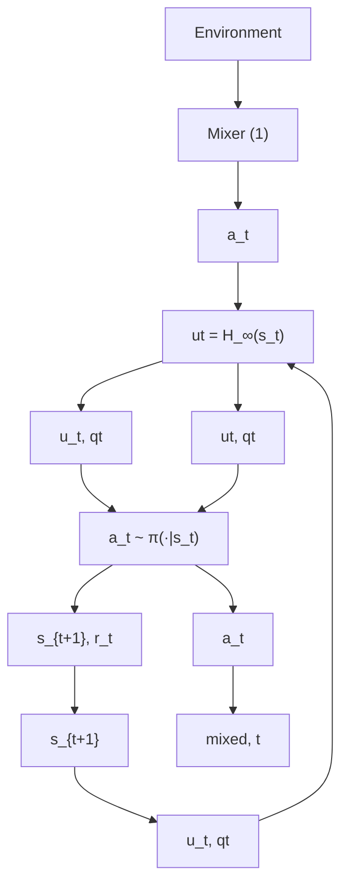

# III. METHODOLOGY

In this section, we first introduce the simulators and formulate the task in the reinforcement learning framework (Sec. III-B). Different from [5], we introduce the $H _ { \infty }$ controller as our base control (Sec. III-C). Lastly, we introduce our robust $H _ { \infty }$ -based deep residual reinforcement learning controller (Sec. III-E) as shown in Fig. 2, where mixer block represents the following equation,

$$a _ {m i x e d} = (1 - q) a + q u \tag {1}$$

flowchart

Fig. 2: Our robust deep residual reinforcement learning framework. Every time step, the mixer gathers the action command from the policy at and the controller $u _ { t }$ and then mixes them based on the mixing factor qt evaluated by the controller.

The second difference from the previous work [5], which applies a fixed number of q, is that we sample it randomly from a distribution. The variable q allows the controller to decide how much authority can be granted to the RL agent, depending on the situation. For example, when the wind disturbance is prominent, the controller can increase q for more intervention and safety.

In the experiments section, we demonstrate that reducing the amount of intervention from the base control q improves the final performance (Sec.IV-C). Therefore, our goal is to design a robust controller to guarantee control stability during both learning and testing phase while a minimum amount of intervention is required.
