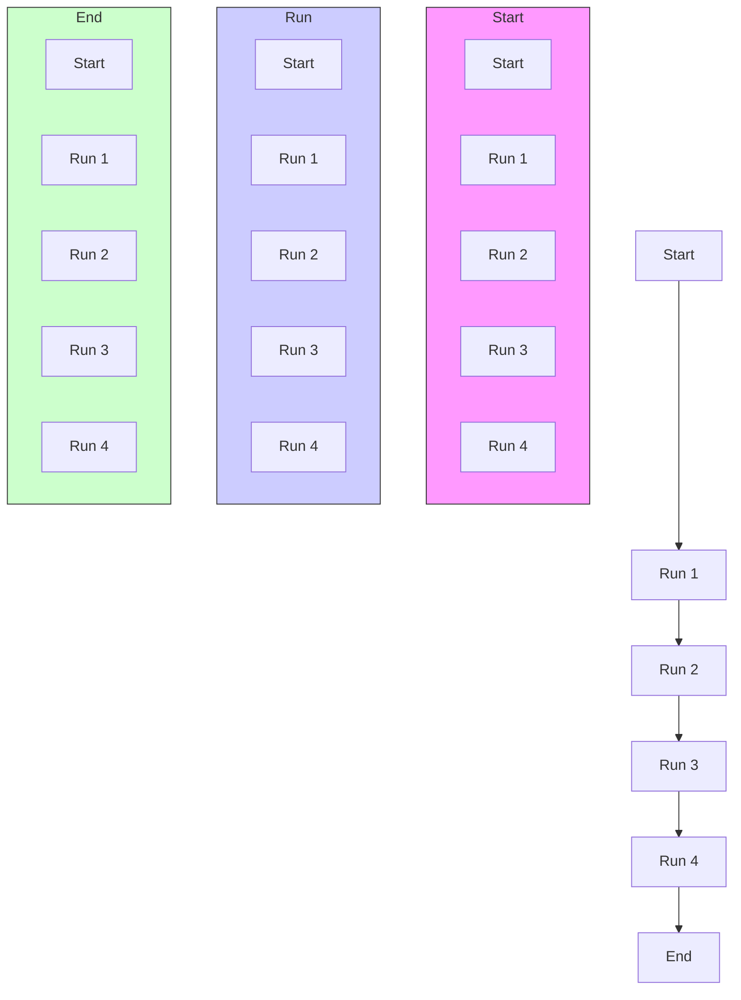

where all states are scaled in the range [0, 1], and the scaled state $( s _ { z } , s _ { l } , s _ { \theta } )$ are the relative altitude z, relative distance $l ,$ relative yaw angle $\theta ,$ augmented with the mixing factor $q ~ \in ~ [ 0 , 1 ]$ and the base control command $\left( u _ { \zeta } , u _ { \eta } , u _ { \epsilon } , u _ { \delta } \right)$ corresponding to the control of rudder deflection, elevator deflection, the servo thrust angle, and the thrust magnitude. The actions $( a _ { \zeta } , a _ { \eta } , a _ { \epsilon } , a _ { \delta } )$ corresponds to the same command channels. Note that the action dynamics are coupled; for example, one can ascend by an elevator when moving forward or directly thrusting upward through the thrust vector.

In this context, there are two major differences from the prior work[5]. First is the usage of the reverse thrust.

flowchart

(a) TurtleSim with parallel data collection. The green turtle is the robot, and the target position is represented by a turtle in another color. The white curve displays the position odometry.

natural_image

3D rendering of a black airship on a grid background, no text or symbols visible

(b) The blimp simulator is implemented in ROS/Gazebo framework. It provides high-fidelity fluid dynamics, and supports software-in-the-loop simulation (SITL) [11].   
Fig. 3: Simulation Environments

Descending a blimp is challenging since the blimp’s heading velocity is usually slow, and, consequently, the altitude descent velocity from the elevator is also slow. This can cause significant altitude tracking errors. And therefore, even though reverse thrusting is generally less efficient, it helps the blimp descend much faster when lacking the heading velocity.
