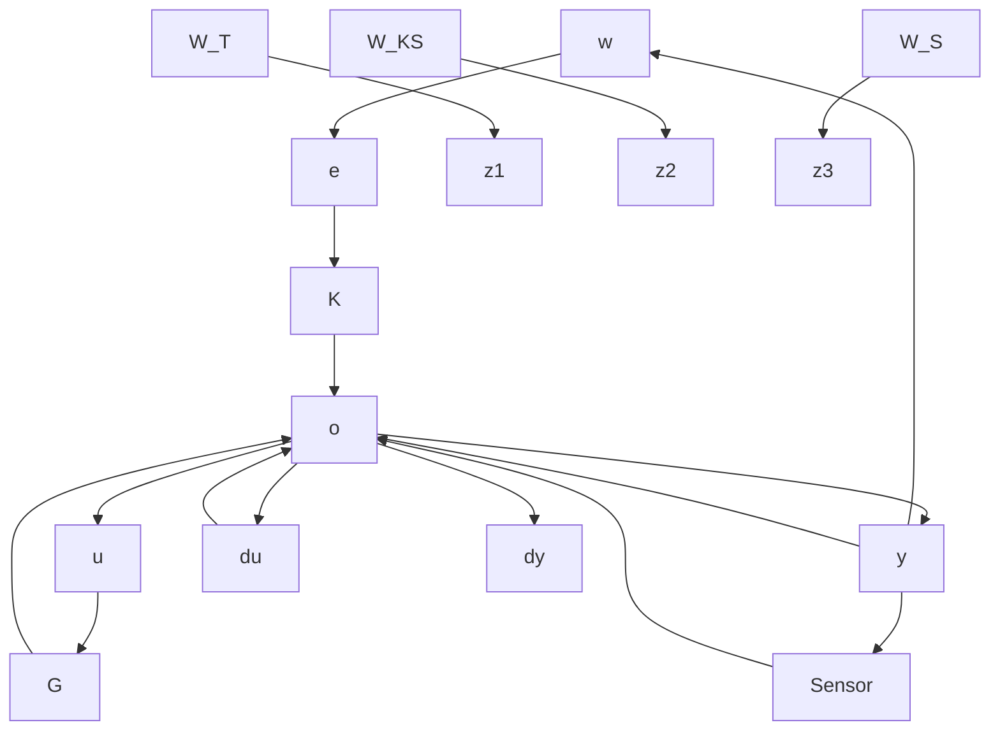

Another difference is that we trigger the next target waypoint only when the total distance to the target is less than a threshold of 5 meters instead of the planar distance. This requires much higher efficiency over the altitude control and poses a more significant challenge for control allocation as there are diverse ways to achieve it, e.g., elevator or thrust vector. We demonstrate in the experiment that the RL agents fail to find any viable control policy without efficiently using thrust vectoring.

The following reward function formulates the navigation task,

$$
r _ {t} = \left[ \begin{array}{c c c} w _ {\text { success }} & w _ {\text { track }} & w _ {\text { penalty }} \end{array} \right] \left[ \begin{array}{c} r _ {\text { success }, t} \\ r _ {\text { track }, t} \\ r _ {\text { penalty }, t} \end{array} \right] \tag {6}
r _ {s u c c e s s, t} = 1 \text { if } | l _ {t} | \leq \epsilon \text { else } 0, \tag {7}r _ {\text { track }, t} = - w _ {z} \left| z _ {t} \right| - w _ {l} \left| l _ {t} \right| - w _ {\theta} | \theta |, \tag {8}r _ {\text { penalty }, t} = \Delta (a, u), \tag {9}$$

where the default value of the task weight is $( w _ { s u c c e s s } , w _ { t r a c k } , w _ { p e n a l t y } ) = ( 5 0 0 , 1 , 1 0 )$ , the tracking reward weight $( w _ { z } , w _ { l } , w _ { \theta } ) = ( 2 , 5 , 2 )$ and $\epsilon = 5 [ \mathrm { m } ]$ . The term $\Delta ( a , u )$ penalizes when the action deviates too much from the base control to encourage the synergy between the agent and the controller. In practice, we found out that without this ad-hoc penalty, RL agents fail to find any viable control policy. At each time step, we initialize $\Delta ( a , u ) = 0$ , and then accumulate it if any of the conditions are triggered,

• $\Delta ( a , u ) \mathrel { + } = - 0 . 5 , \mathrm { i f } \ a _ { \zeta } u _ { \zeta } < 0$ and $| a _ { \zeta } - u _ { \zeta } | > 0 . 4 .$ .   
• ∆(a, u) += −0.5, if aηuη < 0 and $| a _ { \eta } - u _ { \eta } | > 0 . 4$   
• $\Delta ( a , u ) \mathrel { + } = - 0 . 5 , \mathrm { i f } \ a _ { \epsilon } a _ { \delta } > 0$ .   
• $\Delta ( a , u ) \mathrel { + } = 1 , \mathrm { i f } \ a _ { \epsilon } u _ { \epsilon } > 0 .$   
• $\Delta ( a , u ) + = - 0 . 5 , \mathrm { i f } u _ { \eta } = - 1 , u _ { \epsilon } = 0 . 5 \mathrm { a n d } a _ { \epsilon } > 0 . 7 .$

To avoid misuse of the reverse thrust, the third condition

flowchart

