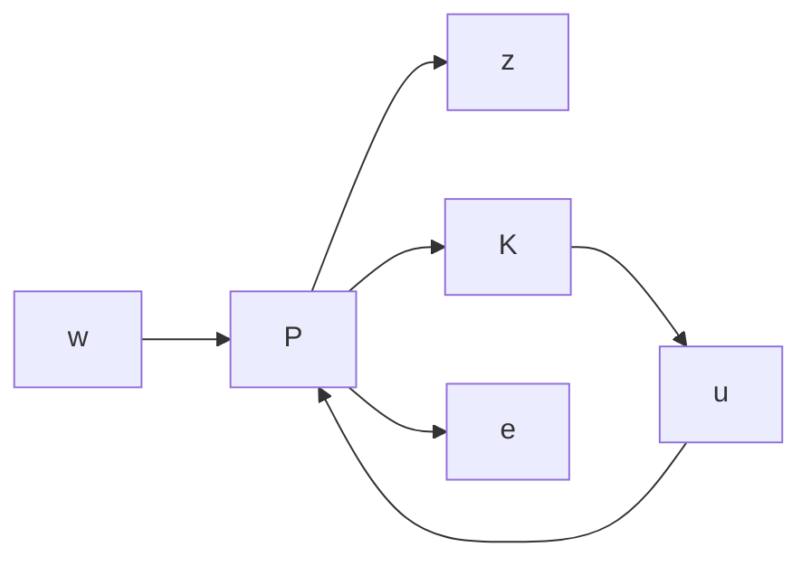

# D. Robust Hybrid $H _ { \infty } { - } R L$ in TurtleSim

Given the controller command $\boldsymbol { u } = [ u _ { v } , u _ { \omega } ] ^ { T }$ , reference $w = [ 0 , 0 ] ^ { T }$ , the state vector $x = [ l , \theta ] ^ { T }$ , and plant output $y = [ l , \theta ] ^ { T }$ , the kinematics of the turtle can be represented by the following state space model,

$$
A _ {t u r t l e} = \left[ \begin{array}{l l} 0 & 0 \\ 0 & 0 \end{array} \right], B _ {t u r t l e} = \left[ \begin{array}{l} - 1 \\ 1 \end{array} \right], \tag {20}

C _ {t u r t l e} = \left[ \begin{array}{l l} 1 & 0 \\ 0 & 1 \end{array} \right], D _ {t u r t l e} = \left[ \begin{array}{l} 0 \\ 0 \end{array} \right]. \tag {21}
$$

Recall that l denotes the relative distance between the turtle and its target, and θ represents the heading angle difference to the target. The kinematic model of the turtle, i.e., the plant G, including the disturbances du and $d y ,$ sensor measurement, and the weighting filters W , yields the augmented plant P (Fig. 5). The augmented plant $P$ is stabilized by a controller K, which is obtained by applying the $H _ { \infty }$ design method given the constraint (11) and Table. II.

flowchart

Fig. 5: $H _ { \infty }$ controller compact form

Now consider the hybrid scenario, and the control command has the following form,

$$a _ {m i x e d} = \left[ (1 - q) a _ {v} + q u _ {v} \quad (1 - q) a _ {\omega} + q u _ {\omega} \right] ^ {T} \tag {22}$$

where $a \sim \pi ( \cdot | s )$ . The mixing factor is sampled randomly from the uniform random distribution at each time step, i.e., $q \sim \mathcal { U } ( 0 , 1 )$ , which satisfies the constraint in (19). Note that it is important for the agent to observe the entire interval of $q \in [ 0 , 1 ]$ during training so that the agent will be able to generalize to any arbitrary q in the testing phase.
