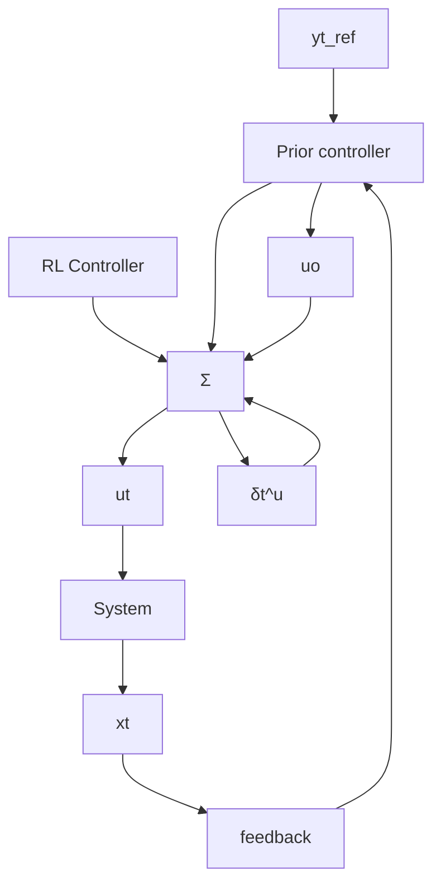

# 4. PROPOSED METHOD

In standard RL, it is typical to start the training from an initial random control policy. This means that initially the controller does not react in a systematic way to changes in the set point, and therefore the collected data may not not excite the system well in amplitude, even if random set points are used.

However, even with limited knowledge about the system it is often possible to design a controller that at least will change the output towards the reference level after it has changed. Even a proportional feedback controller

flowchart

Fig. 1. Block diagram of the closed loop system using the proposed method.

$$g ^ {o} (x _ {t}, y _ {t} ^ {\text { ref }}) = K (y _ {t} ^ {\text { ref }} - y _ {t}) \tag {12}$$

can typically achieve this.

Hence, the idea here is that instead of starting the learning from a random control policy, the controller is given by

$$g (x _ {t}, y _ {t} ^ {\mathrm{ref}}) = g ^ {o} (x _ {t}, y _ {t} ^ {\mathrm{ref}}) + g _ {\theta} (x _ {t}, y _ {t} ^ {\mathrm{ref}}), \tag {13}$$

where $g ^ { o } ( x _ { t } , y _ { t } ^ { \mathrm { r e f } } )$ is a prior controller, and $g _ { \theta }$ is a residual control policy given by a neural network that is trained using a standard RL-method. A block diagram of the closed-loop system is shown in Figure 1. To start from the prior controller, the policy neural network for $g _ { \boldsymbol { \theta } }$ is initialized with the last layer set to zero.
