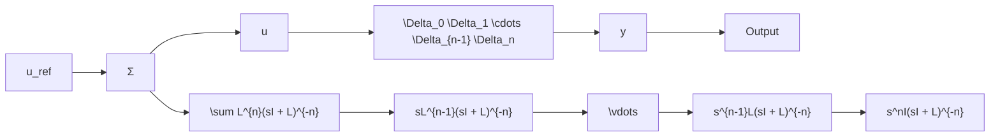
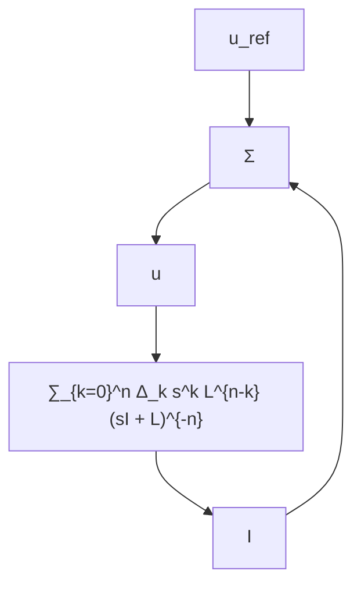

For a diagonal matrix the singular values are given by the absolute value of the diagonal. Let, $\lambda > 0$ be an arbitrary positive constant. The maximum gain for each diagonal can then be calculated through

$$\max _ {\omega} \left| \frac {\omega^ {k} \lambda^ {n - k}}{(j \omega + \lambda) ^ {n}} \right| = \sqrt {\max _ {\omega} \frac {\omega^ {2 k} \lambda^ {2 n - 2 k}}{(\omega^ {2} + \lambda^ {2}) ^ {n}}}.$$

flowchart

Fig. 1: Block diagram illustrating the perturbation model in proof of Theorem 6.

flowchart

Fig. 2: Block diagram illustrating the perturbation model in proof of Theorem 6.

The latter optimization problem is given by a continuous function and thus the derivative must be 0 at the maximum. Simple calculus shows that the optimum is found at $\omega ^ { 2 } = { }$ $\lambda ^ { 2 } k / ( n - k )$ for $k = 0 , 1 , \ldots n - 1$ and at $\omega = \infty$ for $k = n$ Inserting yields

$$
\max _ {\omega} \left| \frac {\omega^ {k} \lambda^ {n - k}}{(j \omega + \lambda) ^ {n}} \right| = \left\{ \begin{array}{c c} \sqrt {\frac {k ^ {k}}{n ^ {n}} (n - k) ^ {n - k}} & \text { if } 0 <   k <   n \\ 1 & \text { else } \end{array} \right.
$$

Now for the case where $\lambda \ = \ 0 .$ . Then we have for $k \mathbf { \Psi } =$ $0 , \ldots , n - 1$

$$\max _ {\omega} \left| \frac {\omega^ {k} 0 ^ {n - k}}{(j \omega + 0) ^ {n}} \right| = 0$$

and for $k = n$

$$\max _ {\omega} \left| \frac {\omega^ {n}}{(j \omega + 0) ^ {n}} \right| = 1.$$

This is less restrictive than for $\lambda > 0$ and thus we can use the result for $\lambda > 0$ . Plugging this into the upper bound of the LH (8) results in the sought inequality.
