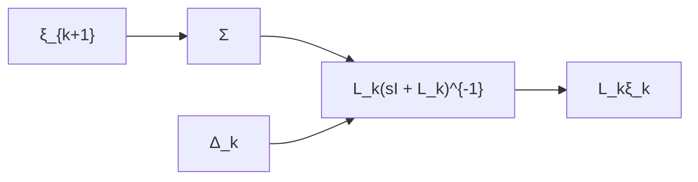

Proof: First, note that we can construct $X ( s ) = \Xi _ { 1 } ( s )$ and $s \Xi _ { k } = - ( I + \Delta _ { k } ) L _ { k } \Xi _ { k } + \Xi _ { k + 1 }$ for $k = 1 , \ldots , n - 1$ and $s ( I + \Delta _ { 0 } ) \Xi _ { n } \ = \ - ( I + \Delta _ { n } ) L _ { n } \Xi _ { n } + U _ { \mathrm { r e f } }$ . For $\Xi _ { n }$ we have exactly the 1st order case of Theorem 6 and thus $\begin{array} { r } { \operatorname* { l i m } _ { t \to \infty } \xi _ { n } ( t ) \ = \ \alpha _ { n } ( t ) \mathbf { 1 } _ { N } \ \mathrm { i f } \ \| \Delta _ { 0 } \| _ { \mathcal { H } _ { \infty } } + \| \Delta _ { n } \| _ { \mathcal { H } _ { \infty } } < 1 } \end{array}$ . Consider the following induction hypothesis: if $\Xi _ { k + 1 } ( s ) =$ $\mathbf { 1 } _ { N } G _ { k + 1 } ( s ) + H _ { k + 1 } ( s )$ where $H _ { k + 1 } ( s ) \in \mathcal { R } \mathcal { H } _ { \infty }$ then $\Xi _ { k } =$ $\mathbf { 1 } _ { N } G _ { k } ( s ) + H _ { k } ( s )$ for some $H _ { k } ( s ) \in \mathcal { R } \mathcal { H } _ { \infty }$ . We have

$$s \Xi_ {k} = - (I + \Delta_ {k}) L _ {k} \Xi_ {k} + \Xi_ {k + 1}$$

which can be represented by the block diagram Fig. 3. Here, note that

$$L _ {k} (s I + L _ {k}) ^ {- 1} \Xi_ {k + 1} = (s I + L _ {k}) ^ {- 1} L _ {k} (H _ {k + 1} (s))$$

and the potentially unstable term of $\Xi _ { k + 1 }$ can be ignored. Reusing a result from the previous proof we have $\| L _ { k } ( s I +$ $L _ { k } ) ^ { - 1 } \| _ { \mathcal { H } _ { \infty } } = 1$ and therefore $L _ { k } \Xi _ { k } \in \mathcal { R H } _ { \infty } \mathrm { ~ i f ~ } \| \Delta _ { k } \| _ { \mathcal { H } _ { \infty } } <$ 1. Since the 0 eigenvalue of $L _ { k }$ is unique, it follows that $\Xi _ { k } ( s ) = \mathbf { 1 } _ { N } G _ { k } ( s ) + H _ { k } ( s )$ with $H _ { k } \in \mathcal { R } \mathcal { H } _ { \infty }$ which proves the induction hypothesis since we have already shown the base case $\Xi _ { n } ( s ) = \mathbf { 1 } _ { N } G _ { n } ( s ) + H _ { n } ( s )$ . Left is to prove that the system will reach $n ^ { \mathrm { t h } }$ order consensus. Note that $L _ { 1 } X ( s ) = L _ { 1 } \Xi _ { 1 } ( s )$ is stable and therefore we get through the final value theorem

$$\lim _ {t \to \infty} L _ {1} x (t) = \lim _ {s \to 0} s L _ {1} \Xi_ {1} (s) = 0.$$

Furthermore, we have for all k: lim $\ O _ { 3 \to 0 } s L _ { k } \Xi _ { k } ( s ) = 0$ . This, combined with $s ^ { 2 } \Xi _ { k } ( s ) = - ( I + \Delta _ { k } ) s L _ { k } \Xi _ { k } ( s ) + s \Xi _ { k + 1 } ( s )$ shows that

$$
\begin{array}{l} \lim _ {t \to \infty} L _ {k + 1} x ^ {(k)} (t) = \lim _ {s \to 0} s (s ^ {k} L _ {k + 1} X (s)) \\ = \lim _ {s \rightarrow 0} s L _ {k + 1} \Xi_ {k + 1} (s) = 0 \\ \end{array}
$$

Finally, since the 0 eigenvalues for each $L _ { k }$ are unique with corresponding eigenvector $\mathbf { 1 } _ { N }$ we see that $n ^ { \mathrm { t h } }$ order consensus will be achieved.

flowchart

Fig. 3: Block diagram illustrating the perturbation model of a general first-order consensus block which is used in the proof of Theorem 7.

This theorem shows that the $n ^ { \mathrm { t h } }$ order serial consensus is robust in its construction.
