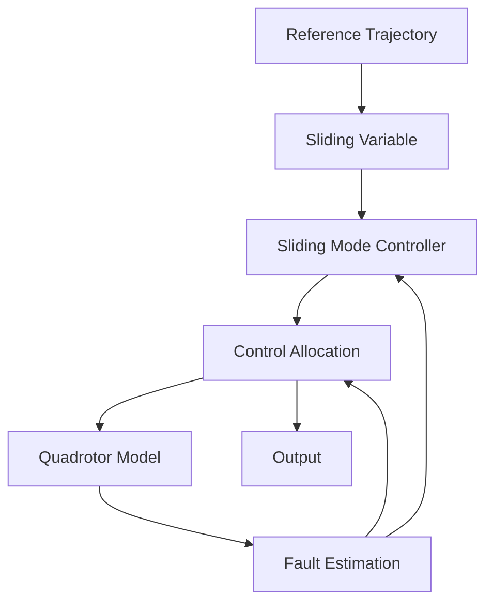

The fault-tolerant super twisting sliding mode controller diagram is represented in Fig. 7. Sliding mode control is a variable structure control method. The state feedback control law is not a continuous function of time. It can switch from one continuous structure to another continuous structure based on the current position in the state space [42], [43]. The sliding variable must be used to define the sliding surface. The reference trajectory is the trajectory given for the quadrotor to follow. The quadrotor tries to follow this trajectory using the sliding mode controller. When an actuator error occurs, and power loss occurs in one of the rotors, the control allocation mechanism is activated. It readjusts the power distribution between the rotors and keeps the quadrotor flying stably.

flowchart

Fig. 7. Block scheme of the proposed controller
