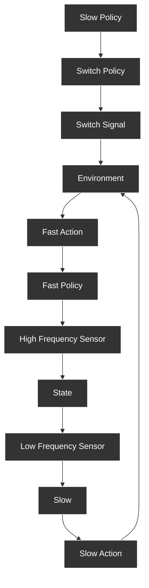

Figure 1: The Temporally Layered Architecture (TLA) comprises two layers: the Slow policy (blue) and the Fast policy (red). The switch policy can activate or deactivate the Fast policy, thus switching between the two layers. The reward given to each network is augmented differently with the energy and consistency penalty, which forces the overall policy to learn temporal abstractions from performance and energy-based contexts.

works, we introduce two different intrinsic reward penalties: an energy penalty and a consistency penalty. The goal of the energy penalty is to encourage the use of the slow layer, aiding learning by adding a constraint that reduces the number of optimal policies to the most efficient ones. The consistency penalty is an intrinsic reward that encodes the inconsistencies between the actions picked by the slow and fast policies, enabling the policies to learn from each other by mimicking behavior.
