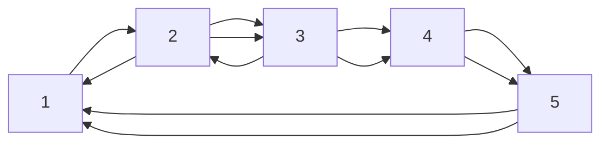
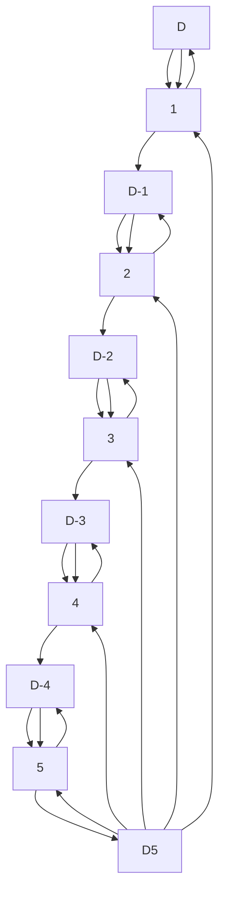

flowchart

```mermaid
graph LR
    1 --> 2
    2 --> 3
    3 --> 4
    4 --> 5
    5 --> 1
    2 --> 3
    3 --> 4
    4 --> 5
    5 --> 1
    3 --> 2
    2 --> 1
```

(a)MDP   

flowchart

```mermaid
graph TD
    T["Time Remaining"] --> 1["State 1"]
    T["Time Remaining"] --> 2["State 2"]
    T["Time Remaining"] --> 3["State 3"]
    T["Time Remaining"] --> 4["State 4"]
    T["Time Remaining"] --> 5["State 5"]
    T["Time Remaining"] --> 6["State 6"]
    T["Time Remaining"] --> 7["State 7"]
    T["Time Remaining"] --> 8["State 8"]
    T["Time Remaining"] --> 9["State 9"]
    T["Time Remaining"] --> 10["State 10"]
    T["Time Remaining"] --> 11["State 11"]
    T["Time Remaining"] --> 12["State 12"]
    T["Time Remaining"] --> 13["State 13"]
    T["Time Remaining"] --> 14["State 14"]
    T["Time Remaining"] --> 15["State 15"]
    T["Time Remaining"] --> 16["State 16"]
    T["Time Remaining"] --> 17["State 17"]
    T["Time Remaining"] --> 18["State 18"]
    T["Time Remaining"] --> 19["State 19"]
    T["Time Remaining"] --> 20["State 20"]
```

(b) Time-Limited MDP

flowchart

```mermaid
graph TD
    D0["D"] --> State1["1"]
    D1["D-1"] --> State2["2"]
    D2["D-2"] --> State3["3"]
    D3["D-3"] --> State4["4"]
    D4["D-4"] --> State5["5"]
    State1 --> D0
    State2 --> D1
    State3 --> D2
    State4 --> D3
    State5 --> D4
    State1 --> D1
    State2 --> D2
    State3 --> D3
    State4 --> D4
    State5 --> D5
    D0 --> State1
    D1 --> State2
    D2 --> State3
    D3 --> State4
    D4 --> State5
    D5 --> State1
    D5 --> State2
    D5 --> State3
    D5 --> State4
    D5 --> State5
```

