# Discrete Decision-Bounded Environment (Gridworld)

  
(a) Straight

(b) Slalom   

```mermaid
graph TD
    A[" "] --> B[" "]
    B --> C[" "]
    C --> D[" "]
    D --> E[" "]
    E --> F[" "]
    F --> G[" "]
    G --> H[" "]
    H --> I[" "]
    I --> J[" "]
    J --> K[" "]
    K --> L[" "]
    L --> M[" "]
    M --> N[" "]
    N --> O[" "]
    O --> P[" "]
    P --> Q[" "]
    Q --> R[" "]
    R --> S[" "]
    S --> T[" "]
    T --> U[" "]
    U --> V[" "]
    V --> W[" "]
    W --> X[" "]
    X --> Y[" "]
```

flowchart

(c) Combined   
Figure 3: Gridworld Environments. The grey box represents the starting state and the blue box is the goal state.

Since many aspects of reinforcement learning are linked to the time step, temporal adaptivity allows TLA to focus on multiple objectives and gain an advantage in performance, learning speed, and the number of decisions in decision-bounded environments. To demonstrate this, we introduce three different gridworld environments, each suited to a different optimal step-size: Straight, Slalom, and Combined (Figure 3). The Straight environment consists of a straight corridor of length 30. This environment can be easily solved by repeating a single action, thus it is easy to reduce the number of decisions in this environment. The Slalom environment consists of long horizontal corridors connected with short vertical turns where action repetition is suboptimal. Finally the Combined environment, combines the Straight and Slalom, so that the episode starts and ends with Straights and has Slalom in between. The environments are deterministic with four available actions to move in one of the four directions. At each environment transition, the agent receives a reward of -1. Upon reaching the goal, the episode ends. However, if the agent runs out of decisions before reaching the goal, the agent receives a large penalty of -50 reward for Straight and Slalom and -100 for combined. The choice of very large negative reward is chosen solely to distinguish between agents that run out of decisions and agents that do not. The number of decisions is limited to 15 for Straight and Slalom and 60 for combined.
