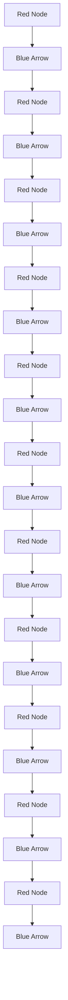

C   

text_image

Ã₁↔₂
β
A₂
Subtract
A₁
α
dz
-1 0 1

b   

d   

flowchart

Fig. 1: Overview of this work: (a) Hybrid dynamics of legged locomotion are a challenge for typical geometric mechanics tools. (b) The simplest illustrative formulation of a quasistatic legged locomotion system - a two-footed model. (c) The stratified locomotion panel framework presented in this work and its application for generating net body displacement over a gait cycle. (d) The piecewise holonomic trajectory (above) and the net displacement (below) of a two-footed contact switching system undergoing a single gait cycle.
