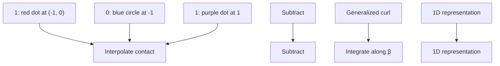

# D. Stratified Panel Method Simplification - The Switching Flux

Using the switching-mode local connection (6), we compute the system’s displacement, $z _ { \phi } ,$ , over a given gait cycle, $\phi \in \Phi$ , by a generalized Stokes’ Theorem based surface integral [3] as:

$$z _ {\phi} = \iint_ {\phi_ {a}} - \left(\frac {\partial \tilde {\boldsymbol {A}} ^ {(2)}}{\partial \alpha} - \frac {\partial \tilde {\boldsymbol {A}} ^ {(1)}}{\partial \tilde {\beta}}\right) d \alpha d \tilde {\beta} \tag {7}$$

where $\phi _ { a }$ is the signed region of the shape-space enclosed by $\phi ,$ and $\tilde { A } ^ { ( 1 ) }$ and $\tilde { A } ^ { ( 2 ) }$ are the two columns in ${ \tilde { A } } .$ Since rotations (2) are disabled in this system, (7) does not include the first-order Lie bracket. The associated integrands (Fig. 3c) called constraint curvature functions (CCFs [3], or height functions) quantify the displacement strength over an infinitesimal cycle at each point in the shape space. Since switching contact does not cause motion, mathematically, $\tilde { A } ^ { ( 2 ) }$ is a null vector, and enables us to obtain a simpler formulation of the

a   

flowchart

Fig. 3: (a) The interpolated contact-state functions, $\tilde { c } _ { 1 }$ and ${ \tilde { c } } _ { 2 }$ aid in formulating a continuously changing, locomotion submanifold, $S _ { 1  2 }$ and the corresponding (b) interpolated connection vector fields (each submanifold is highlighted); followed by (c) constraint curvature functions in translational coordinates obtained from Stokes’ surface integral, (d) the stratified panels that encode displacement accrued from infinitesimal gaits at each α (vertical strips), and (e) finally, a collapsed one-dimensional representation of the stratified panel.

CCFs specific to hybrid locomotion systems called stratified panels (Figs. 3d and 3e) as:
