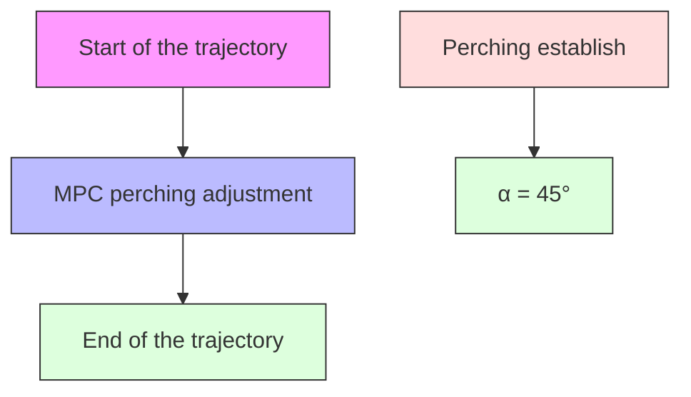

text_image

(c)
Start of the trajectory
End of the trajectory
Perching establish
α = 135°

Fig. 3. Examples of the perching process for planes with different incline angles. (a) Perch to a 90◦ wall. (b) Perch to a 45◦ inclined plane. (c) Perch to a 135◦ slope.

2) System control: This quadrotor is using a cascaded control framework base on PX4 that is also widely used in existing UAVs. The position and velocity controller produces the desired acceleration, which provides the desired thrust and attitude for the attitude controller and subsequent control loops. In order to reduce computational demands and complexity, we impose a constraint that the thrust generated by each propeller is always in the same direction, either all pointing upward or all pointing downward at the same time with respect to the quadrotor body. As a result, for one desired acceleration, there are two sets of desired thrust and attitude, including positive thrust with normal attitude and negative thrust with reverse attitude. The quadrotor only chooses the desired attitude and the relative thrust that is closer to its current attitude, preventing unnecessary flips.
