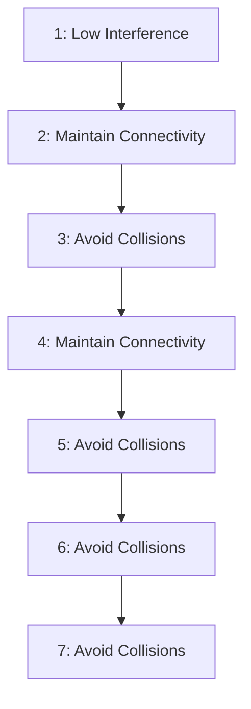

style Low Interference Safe Interaction Controller fill:#f9f,stroke:#333
    style Safety Controller fill:#ccf,stroke:#333
    style Performance Controller fill:#cfc,stroke:#333
```
</details>


<details>
<summary>flowchart</summary>


</details>

Fig. 1: Our Low Interference Safe Interaction Controller (LISIC) policy blends a single-agent performance control input with a flocking-based safety control input to avoid connectivity losses and collisions in a multi-agent network while minimally interfering with the performance objective of each agent. This ensures safe performance in ocean environments with strong ocean currents affecting the low-powered agents.

to nudge itself into favorable flows, an agent can achieve its objective with very little energy [4]–[8].

Given such individual agent performance controllers [4], we aim to develop a method that extends to multi-agent systems operating in complex flows while ensuring network connectivity and avoiding collision among agents. From the control perspective, this is challenging because of two key reasons. First, disconnections are sometimes unavoidable in the underactuated setting, where the agent’s individual propulsion is smaller than the surrounding flows, as the nonlinear, time-varying flows can push agents in opposing directions. The safe interaction controller needs to be resilient and recover connectivity after losing it. Second, constraint satisfaction needs to be traded off intelligently with the performance objective of each agent. For example, a time-optimal controller for an agent would prefer staying in strong flows, which can conflict with the network connectivity objective. Our insight is that we can simplify this multi-agent problem using three different controllers in a Hierarchical Control of Multi-Agent-Systems (H-MAS) approach (Fig. 1).
