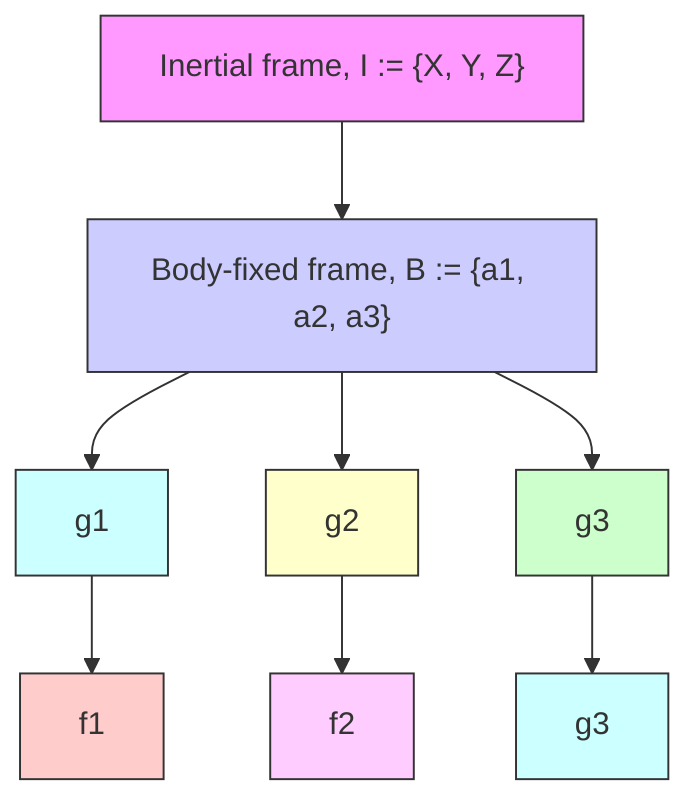

# 4.1. Coordinate frame definition

The configuration of the vehicle, modeled as a rigid body, is given by its position and orientation, which are together referred to as its pose. To define the pose of the vehicle, we fix a coordinate frame B to its body and another coordinate frame I that is fixed in space as the inertial coordinate frame. Define $\mathbf { e } _ { i }$ as the unit vector along the ith coordinate axis for $i = { 1 , 2 , 3 } .$ . Let $b \in \mathbb { R } ^ { 3 }$ denote the position vector of the origin of frame B with respect to frame I. Let SO(3) denote the orientation (attitude), defined as the rotation matrix from frame B to frame I. The pose of the vehicle can be represented in matrix form as follows:

$$
g = \left[ \begin{array}{l l} R & b \\ 0 & 1 \end{array} \right] \in \mathrm{SE} (3) \tag {37}
$$

where $\operatorname { S E } ( 3 )$ , the special Euclidean group, is the six-dimensional Lie group of rigid body motions. A diagram of guidance and trajectory tracking on $\operatorname { S E } ( 3 )$ through a set of waypoints is presented in Figure 1 as follows.

flowchart

Figure 1: Guidance of a rotorcraft UAV through a trajectory between initial and final configurations on SE(3) Hamrah and Sanyal (2022); Viswanathan et al. (2018)
