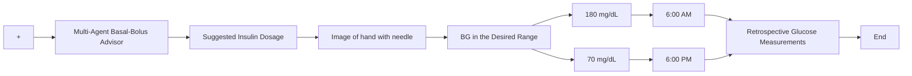

On the other hand, optimizing an AID system to implement MDI therapy in individuals with type 1 diabetes (T1D) poses a complex challenge [9]. This involves careful consideration of both basal and bolus insulin doses based on the patient’s BG readings. CGM sensors play a crucial role in obtaining frequent BG readings, typically at a sampling rate ranging from 5 to 15 minutes. Additionally, incorporating personalized insulinto-carbohydrate ratios and correction factors is essential to enhance the accuracy of calculated meal boluses.

In the field of diabetes management, extensive research has been conducted to develop insulin delivery algorithms for automating the MDI regimen. Various methodologies have been explored in the literature, including PID and fuzzy logic approaches [10, 11], optimization-based methods [12, 13, 14], and iterative learning strategies [5, 15].

flowchart

Figure 1: Block Diagram of the proposed closed-loop control of the BG level, using a multi-agent RL-based methodology

Cescon et al. (2019) explored the application of ILC with sparse measurements for long-acting insulin injections in T1D patients [16]. They utilized ILC to administer basal insulin through once-a-day dosing of long-acting insulin analogs, incorporating a modified metabolic model that considers subcutaneous insulin kinetics. Simulation results showcased the advantages of this approach, including robust performance in the presence of induced insulin resistance.
