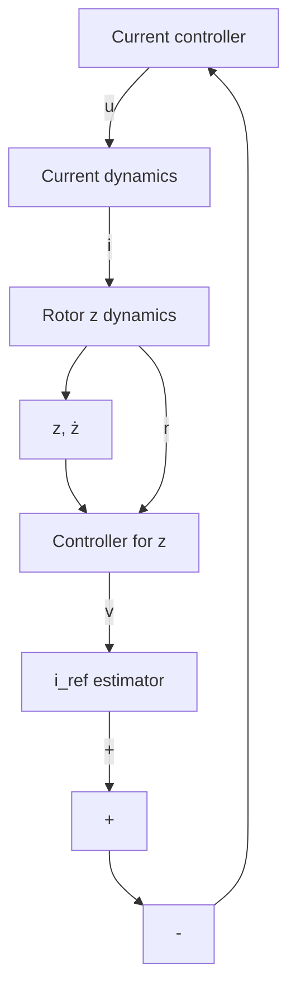

<table><tr><td>Symbol</td><td>Description</td><td>Value</td></tr><tr><td> $m$ </td><td>Mass of rotor and axle</td><td>0.588 kg</td></tr><tr><td> $k_z$ </td><td>Axial stiffness</td><td>-754 N m</td></tr><tr><td> $\mu_0$ </td><td>Vacuum permeability</td><td> $1.25 \cdot 10^{-6} \text{ N/A}^2$ </td></tr><tr><td> $n$ </td><td>Number of coil windings</td><td>1480</td></tr><tr><td> $A$ </td><td>Cross-sectional area</td><td>0.121  $\text{m}^2$ </td></tr><tr><td> $s_0$ </td><td>Air gap size</td><td> $5 \cdot 10^{-3} \text{ m}$ </td></tr><tr><td> $i_0$ </td><td>Bias current</td><td>0.25 A</td></tr><tr><td> $R$ </td><td>Coil resistance</td><td>41.44 Ω</td></tr><tr><td> $g$ </td><td>gravitational acceleration</td><td>9.81  $\text{m/sec}^2$ </td></tr></table>

flowchart

Fig. 2. Control architecture for the AMB system.
