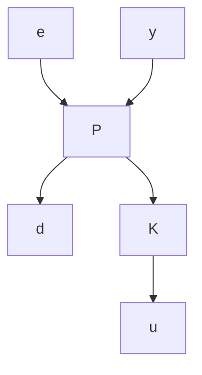

# B. Problem Formulation

Consider the feedback interconnection shown in Figure 1. The interconnection, denoted $F _ { L } ( P , K )$ , consists of a controller K in feedback around the lower channels of the plant P . This is a standard feedback diagram for optimal control formulations in the robust control literature [1], [2]. The plant P is a discrete-time, linear time-invariant (LTI) system with the following state-space

representation:

$$
\left[ \begin{array}{c} x _ {t + 1} \\ e _ {t} \\ y _ {t} \end{array} \right] = \left[ \begin{array}{c c c} A & B _ {d} & B _ {u} \\ C _ {e} & 0 & D _ {e u} \\ C _ {y} & D _ {y d} & 0 \end{array} \right] \left[ \begin{array}{c} x _ {t} \\ d _ {t} \\ u _ {t} \end{array} \right], \tag {2}
$$

where $x _ { t } \in \mathbb { R } ^ { n _ { x } }$ is the state, $d _ { t } \in \mathbb { R } ^ { n _ { d } }$ is the disturbance, $e _ { t } \in \mathbb { R } ^ { n _ { e } }$ is the error, $u _ { t } \in \mathbb { R } ^ { n _ { u } }$ is the control input and $y _ { t } \in \mathbb R ^ { n _ { y } }$ is the measured output. The plant (2) assumes zero feedthrough matrices from u to y and from d to e, i.e. $D _ { y u } \ = \ 0$ and $D _ { e d } = ~ 0$ . A standard loop-shift transformation can be used, under mild technical conditions, to convert plants with $D _ { y u } \neq 0$ and/or $D _ { e d } \neq 0$ into the form of Equation 2 (Section 17.2 of [1]).

flowchart

Fig. 1. Generic feedback interconnection $F _ { L } ( P , K )$ for synthesis.

The goal is to design an output-feedback controller K to stabilize the plant and ensure the error remains “small”. The cost achieved by a controller K on a disturbance $d \in \ell _ { 2 }$ (assuming $x _ { - \infty } = 0 )$ is:

$$J (K, d) := \| e \| _ {2} ^ {2} = \sum_ {t = - \infty} ^ {\infty} e _ {t} ^ {\top} e _ {t}. \tag {3}$$

Here the cost is defined using a two-sided disturbance $d \in \ell _ { 2 }$ defined from $t = - \infty$ to $t = \infty$ . It is common to formulate optimal control problems using one-sided $\ell _ { 2 }$ signals starting from $t = 0$ with the initial condition $x _ { 0 } = 0$ . However, a non-causal controller will be introduced later. Two-sided signals are used to avoid nonzero initial conditions arising from this non-causal controller.

To simplify notation, define $Q : = C _ { e } ^ { \top } C _ { e } , S : = C _ { e } ^ { \top } D _ { e u }$ and $R : = D _ { e u } ^ { \top } D _ { e u }$ . The cost can be re-written as:
