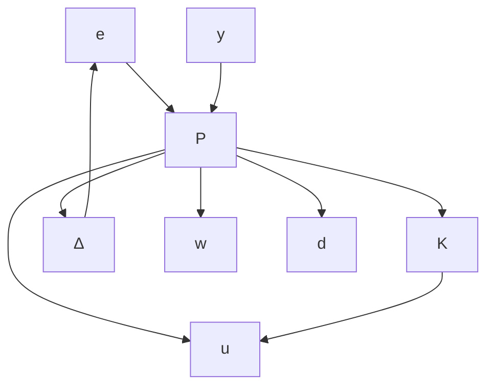

# A. Problem Formulation

Consider the feedback interconnection shown in Figure 3. This interconnection, denoted ${ \mathit { C L } } ( P , K , \Delta )$ , includes an uncertainty $\Delta$ and controller K wrapped around the upper and lower channels of the plant P , respectively. This is a standard feedback diagram in the robust control literature for the case of uncertain systems, e.g. see Chapter 11 of [1] or Chapter 8 of [2]. The plant P is a discrete-time, LTI system with additional input/output channels $( w , v )$ to incorporate the effect of the uncertainty:

$$
\left[ \begin{array}{c} x _ {t + 1} \\ v _ {t} \\ e _ {t} \\ y _ {t} \end{array} \right] = \left[ \begin{array}{c c c c} A & B _ {w} & B _ {d} & B _ {u} \\ C _ {v} & D _ {v w} & D _ {v d} & D _ {v u} \\ C _ {e} & 0 & 0 & D _ {e u} \\ C _ {y} & D _ {y w} & D _ {y d} & 0 \end{array} \right] \left[ \begin{array}{c} x _ {t} \\ w _ {t} \\ d _ {t} \\ u _ {t} \end{array} \right], \tag {17}
$$

where $w _ { t } \in \mathbb { R } ^ { n _ { w } }$ and $v _ { t } \in \mathbb { R } ^ { n _ { v } }$ are the input/output signals associated with the uncertainty. The other signals have similar interpretations as given for the nominal case in Section II-B.

flowchart

Fig. 3. Feedback interconnection ${ \mathit { C L } } ( P , K , \Delta )$ for robust synthesis.

Let ∆ denote the set of $n _ { w } \times n _ { v }$ , discrete-time LTI systems that are causal, stable, and have $\| \Delta \| _ { \infty } \leq 1$ . Thus each $\Delta \in \Delta$ has a state-space representation:

$$
\left[ \begin{array}{l} x _ {t + 1} ^ {\Delta} \\ w _ {t} \end{array} \right] = \left[ \begin{array}{l l} A _ {\Delta} & B _ {\Delta} \\ C _ {\Delta} & D _ {\Delta} \end{array} \right] \left[ \begin{array}{l} x _ {t} ^ {\Delta} \\ v _ {t} \end{array} \right]. \tag {18}
$$

We only assume that each $\Delta \in \Delta$ has a finite-dimensional state but the state dimension is arbitrary. This is referred to as unstructured uncertainty in the robust control literature [1]. The results in this paper can be extended to LTI uncertainty with infinite state dimension but this requires additional technical machinery.
