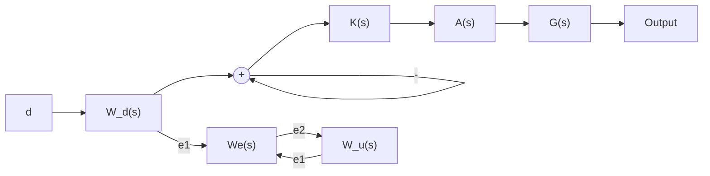

# A. Simple SISO Design

This section presents a simple, SISO design example. This example is useful to gain some additional insights about the performance of the various nominal and robust regret controllers discussed in this paper. Consider the classical feedback diagram in Figure 5 with the (continuoustime) plant $\begin{array} { r } { G ( s ) = \frac { 1 5 } { s + 5 . 6 } } \end{array}$ . The actuator dynamics $A ( s )$ are assumed to be uncertain:

$$A (s) = A _ {0} (s) \cdot \left(1 + W _ {\text {unc}} (s) \Delta (s)\right), \tag {25}$$

where Wunc(s) = 3s+4.62 $\begin{array} { r } { W _ { u n c } ( s ) = \frac { 3 s + 4 . 6 2 } { s + 2 3 . 1 } } \end{array}$ and $\Delta ( s )$ is a stable, LTI system satisfying $\| \Delta \| _ { \infty } \leq 1$ . The weight $W _ { u n c } ( s )$ has DC gain of 0.2, $| W _ { u n c } ( j \infty ) | = 3 .$ , and a zero near −1.5rad/sec. This represents a relatively small uncertainty (20%) uncertainty at low frequencies with increasing uncertainty above 1.5rad/sec. The continuous-time plant and actuator models are discretized using zero-order hold with a sample time $T _ { s } = 0 . 0 0 1 \ \mathrm { s e c . } ^ { \ P }$

flowchart

Fig. 5. Feedback interconnection for SISO design example.

Figure 5 also includes weights to describe the performance objectives. There is one generalized disturbance d that accounts for the effect of the reference command. The two generalized errors $e _ { 1 }$ and $e _ { 2 }$ represent the competing objectives between reference tracking and control effort. The corresponding weights are:

$$W _ {d} (s) = \frac {8}{s + 8}, \tag {26}W _ {e} (s) = \frac {0 . 5 s + 6 . 9 3}{s + 0 . 0 6 9 3}, \tag {27}W _ {u} (s) = \frac {1 0 0 0 s + 8 0 4}{s + 8 0 4 0}. \tag {28}$$
