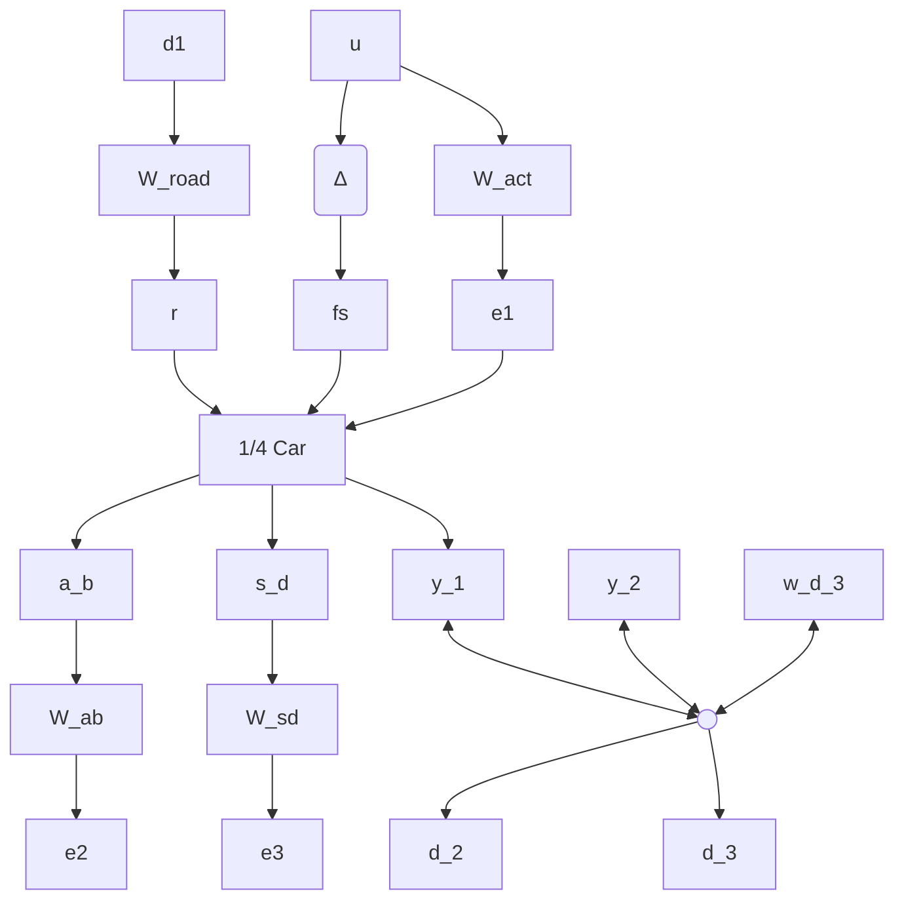

Fig. 11. Feedback interconnection for quarter-car disturbance rejection.

${ } ^ { \parallel } A _ { 0 } ( s )$ and $W _ { u n c } ( s )$ are discretized with sample time $T _ { s }$ . The normalized uncertainty is replaced by a discrete-time, stable LTI system $\Delta ( z )$ with sample time $T _ { s }$ satisfying $\| \Delta \| _ { \infty } \leq 1$ .

The active suspension design (Figure 11) falls within the general nominal design interconnection framework (Figure 3). We first designed a nominal additive regret controller. This design was performed on the interconnection with no uncertainty so that the actuator is at the nominal dynamics, $A ( s ) = A _ { 0 } ( s )$ . The optimal additive regret controller achieved (within a bisection tolerance) a regret of $( \gamma _ { d } , \gamma _ { J } ) ~ = ~ ( 0 . 4 3 , 1 )$ . \*\* We also designed an optimal robust, additive regret controller including the actuator uncertainty. The robust additive regret controller achieved $( \gamma _ { d } , \gamma _ { J } ) = ( 0 . 7 8 , 1 )$ . Figure 12 shows Bode magnitude plots from road input to body acceleration (without the various weights shown in Figure 11). The plot shows responses for the open-loop (OL) and closed-loop (CL) with nominal additive regret (AR) and robust additive regret (Rob) controllers. The lightly damped suspension modes are evident in the open-loop response near $7$ and 58 rad/sec. Both the nominal and robust additive regret controllers reduce the effect of the first open loop mode near 7 rad/sec. The other mode near 58 rad/sec cannot be reduced due to a transmission zero in the plant model.

line

| Frequency, rad/sec | OL | CL-AR | CL-Rob |
| --- | --- | --- | --- |
| 1 | 0 | 0 | 0 |
| 10 | 42 | 40 | 38 |
| 100 | 40 | 57 | 40 |

Fig. 12. Bode magnitude plots from road input to body acceleration output for the open-loop (OL) and closed-loop (CL) with nominal additive regret (AR), and robust additive regret (Rob) controllers.
