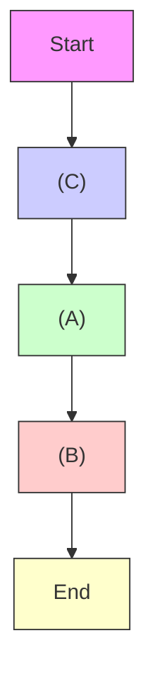

# ISSUES IN REAL-WORLD DATA

(Quasi-)real-time detection of topology changes is part of transmission system SE. However, SM measurement timeseries can be used [9] to calibrate network topology for realtime use, improving the existing datasets at the same time. The

Sandia report [3] develops methodologies for phase identification, meter-to-transformer mapping, identification of voltage regulators, PV systems and their parameters, and many more.

Table 1 lists a number of DN data issues, together with a summary of their impact on decision support methods. We find that the following are broadly under-addressed:

1. Meter-phase alignment for three-phase residential consumers, as well as transformer/breaker monitors.   
2. Some topology errors: incorrect meter-to-transformer assignments (see Fig. 1 errors (B)-(C)), missing information on single-phase branches off the main feeder, missing information on neutral grounding points.   
3. Transformer and regulator models: wrong nominal voltage rating (e.g., 433 vs 415 vs 400 V phase-to-phase for European style 3-phase grids) frequently caused by semantic confusion related to ‘voltage levels’, and more broadly missing parameters of winding configuration, vector group and impedance.   
4. Missing detail on DER smarts, e.g. PV and battery control.

Furthermore, combinations of multiple error sources in the models are also under-addressed, while in our industrial experience, we observed that these are likely and can be critical. For instance, phase identification methods perform noticeably worse if topology errors are present in addition to unknown/wrong phase assignment.

In the upcoming sections we elaborate on the most common DN model errors and point out some relevant literature.

flowchart

Fig. 1: Examples of possible user-to-cable errors in LVDN data. The user in (A) is actually connected to the wrong branch of the same feeder, that in (B) is connected to the wrong feeder altogether. Finally, the switch status (C) is is wrong, and the two users between the switches are assigned to a wrong feeder.
