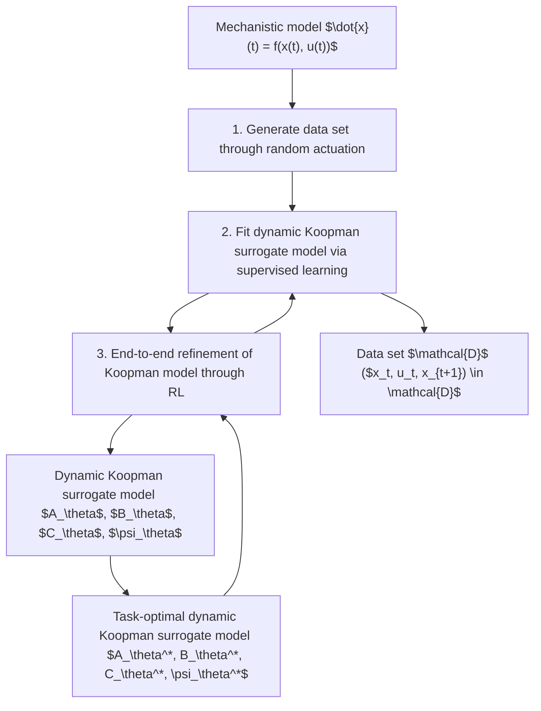

# 2.4 End-to-end learning of Koopman models for MPC

Figure 1 summarizes our proposed workflow for training task-optimal Koopman surrogate models. We start with the standard SI procedure for dynamic surrogate models, given a mechanistic model: First, we generate a data set D from which the system dynamics can be learned using supervised learning, by (randomly) actuating the mechanistic model. Second, we fit a dynamic surrogate model, in our case a Koopman model with learnable parameters $\theta ,$ to the data. As described in Section 2.1, our Koopman models consist of a nonlinear encoder $\psi _ { \theta }$ , the matrices $A _ { \theta }$ and $B _ { \theta }$ that represent the linear dynamics inside the Koopman space, and a decoder matrix $C _ { \theta }$ . Lusch et al. (2018) identify three high-level requirements for autoregressive dynamic Koopman models that correspond to three types of loss functions that need to be combined when performing system identification. The extension to Koopman models for controlled systems and the model structure by Korda and Mezić (2018) is straightforward and results in the following requirements and loss functions:

1. Identification of nonlinear lifting functions ψθ that allow for a linear reconstruction through $C _ { \theta }$ . The associated loss function is the autoencoder loss given by

$$\left| \left| \boldsymbol {C} _ {\boldsymbol {\theta}} \psi_ {\boldsymbol {\theta}} (\boldsymbol {x} _ {t}) - \boldsymbol {x} _ {t} \right| \right|. \tag {2}$$

2. Identification of linear latent space dynamics,

flowchart

Fig. 1. Workflow from mechanistic model to task-optimal dynamic Koopman surrogate model.

using the prediction loss:
