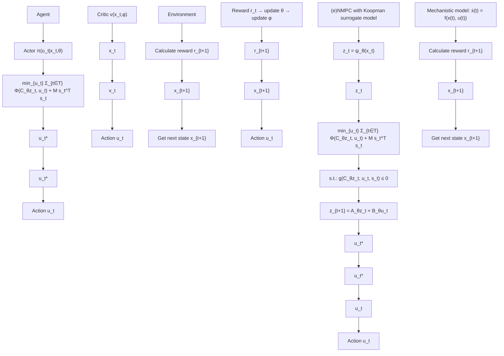

flowchart

Fig. 2. Method for end-to-end refinement of dynamic Koopman surrogate model. The RL agent consists of a stochastic actor and a critic. The actor is an MPC policy utilizing a dynamic Koopman surrogate model. The critic is a feedforward neural network. The environment consists of the mechanistic model 00. Monat 2017 Seite 38of the system that is to be controlled, and a reward function that depends upon the controllers task.

We use a critic in the form of a multilayer perceptron (MLP) with learnable parameters $\phi$ and generalized advantage estimation (Schulman et al. (2015b)) to calculate the advantage estimates during training. These are used to compute the actor loss via the clipped PPO loss function and to update the actor parameters θ accordingly (Schulman et al. (2017)). We also use global gradient clipping to stabilize the training, as described by Engstrom et al. (2020). We use the Adam optimizer (Kingma and Ba (2014)) to train both the actor and the critic.
