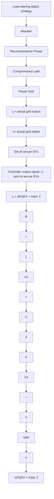

flowchart

```mermaid
graph TD
    A["Load altering attack strategy"] --> B["Attacker"]
    B --> C["Reconnaissance Phase"]
    C --> D["Compromised Load"]
    D --> E["Power Grid"]
    E --> F["y = actual grid output"]
    F --> G["x= actual grid states"]
    G --> H["Set of secure EVs"]
    H --> I["Controller output signal, u, sent to secure EVs"]
    I --> J["u = ΔPQEV = Kdef, x̂"]
    J --> K["B"]
    K --> L["+"]
    L --> M["L"]
    M --> N["uo"]
    N --> O["+"]
    O --> P["C"]
    P --> Q["ŷ"]
    Q --> R["A"]
    R --> S["1/s"]
    S --> T["÷"]
    T --> U["x̂"]
    U --> V["kdef"]
    V --> W["u"]
    W --> X["ΔPQEV = Kdef, x̂"]
```

Fig. 1. Defender’s state-space model and interaction with the attacked grid
