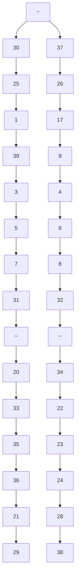

# 4. CASE STUDIES AND SIMULATIONS

In this section, we demonstrate our EV mitigation scheme against static, switching, and dynamic attacks on the New England (NE) 39-bus grid in Fig. 2. [50]. We first demonstrate the impact of the attacks in the absence of our scheme to highlight their devastating impact. The NE grid has 39 buses, 10 generators, and 19 loads with a total of 6,097MW. The simulations were performed on MATLAB-Simulink 2021a Specialized Power Systems Toolbox using a variable step size of $\mid \times 1 0 ^ { - 1 2 } \tan 1 \times 1 0 ^ { - 9 }$ .

flowchart

Fig.2. New England 39-bus grid

While we acknowledge that the current number of EVs is not enough to exploit the full potential of the suggested mitigation scheme, the following example demonstrates its feasibility with increased EV adoption levels. To demonstrate this, we choose a similarly sized grid which is the New South Wales (NSW) grid on a day in December 2021 [51]. The average load is 6968 MW [51] and the total registered vehicles are 5,892,206 [52]. Scaled down to fit our test grid, the total number of vehicles is 5,155,681.
