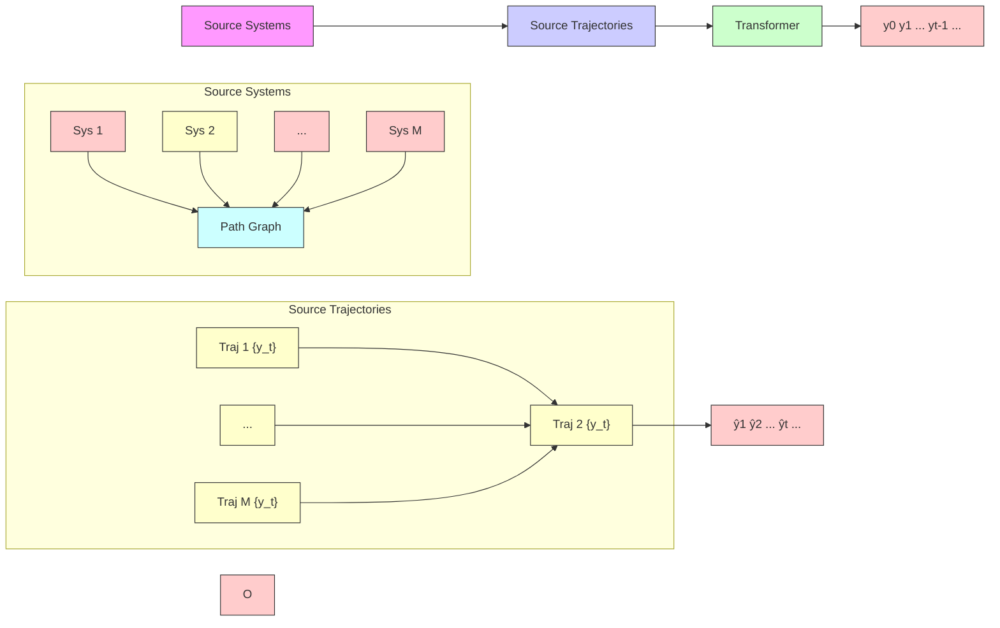

Fig. 1. Training a transformer for dynamical system prediction

Prediction, on the other hand, in the domain of natural language processing, has witnessed recent success thanks to the transformer models [5], which are deep learning architectures that can generate text prediction after feeding into an input text sequence. In this work, we investigate the use of transformers in predicting dynamical system’s outputs.

To begin with, we assume a priori access to a collection of M systems drawn from some distribution $\mathcal { D } _ { s y s }$ and their respective output trajectories $\left\{ \mathbf { y } _ { t } \right\}$ . These are referred to as source systems and trajectories respectively. We then train a transformer using the source trajectories so that after feeding into past outputs $\mathbf { y } _ { 0 : t - 1 }$ , the transformer is able to produce an estimate $\hat { \mathbf { y } } _ { t }$ of the true output $\mathbf { y } _ { t }$ (as in Fig 1). During test-time, given a previously unseen system from the same distribution $\mathcal { D } _ { s y s } ,$ , we feed its observed trajectory to the trained transformer and evaluate its prediction performance. As discussed in [6], in this setting transformer acts like a data-driven adaptive algorithm: given a system, the transformer is able to automatically adapt to it and make predictions by leveraging past data. In the remainder of this paper, we refer to a transformer trained in this way as meta-output-predictor (MOP).
