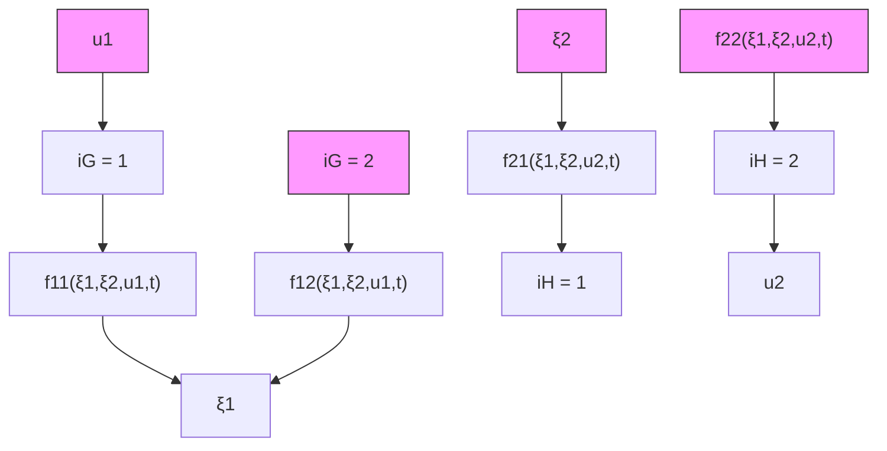

$$
\mathcal {G}: \left\{ \begin{array}{l l} \dot {\xi} _ {1} = f _ {1 1} (\xi_ {1}, \xi_ {2}, u _ {1}, t) & \text { for   } i _ {\mathcal {G}} = 1, \\ \dot {\xi} _ {1} = f _ {1 2} (\xi_ {1}, \xi_ {2}, u _ {1}, t) & \text { for   } i _ {\mathcal {G}} = 2. \end{array} \right. \tag {12}

\mathcal {H}: \left\{ \begin{array}{l l} \dot {\xi_ {2}} = f _ {2 1} (\xi_ {1}, \xi_ {2}, u _ {2}, t) & \text { for   } i _ {\mathcal {H}} = 1, \\ \dot {\xi_ {2}} = f _ {2 2} (\xi_ {1}, \xi_ {2}, u _ {2}, t) & \text { for   } i _ {\mathcal {H}} = 2. \end{array} \right. \tag {13}
$$

flowchart

Figure 1: Feedback interconnection of two switched nonlinear systems
