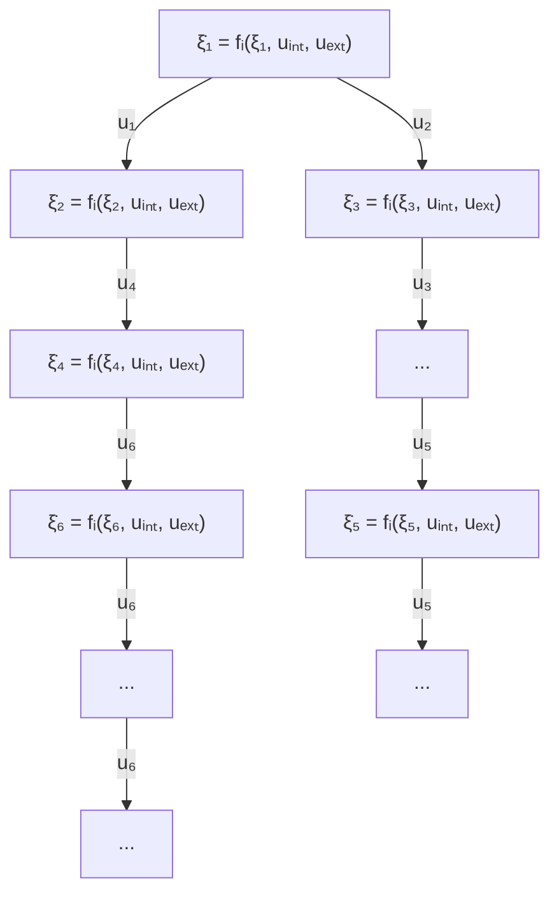

# 6.1 Feedback Connection

Here, we consider a simple example of having two systems defined in (11), switching between two modes based on state-dependent conditions. This numerical example is representative of complex switching systems connected in feedback.

$$
\mathcal {G}: \left\{ \begin{array}{l l} \dot {\xi} _ {1} = - 4 \xi_ {1} - 3 \xi_ {1} ^ {2} + 2 \xi_ {2} + u _ {1} & \text { for   } i = 1, \text {   when   } \xi_ {1} > 0, \\ \dot {\xi} _ {1} = - 4 \xi_ {1} + 3 \xi_ {1} ^ {2} + 2 \xi_ {2} + u _ {1} & \text { for   } i = 2, \text {   when   } \xi_ {1} <   0. \end{array} \right. \tag {48}

\mathcal {H}: \left\{ \begin{array}{l l} \dot {\xi_ {2}} = - 8 \xi_ {2} - 3 \xi_ {2} ^ {2} + 3 \xi_ {1} + u _ {2} & \text { for   } i = 1, \text {   when   } \xi_ {2} > 0, \\ \dot {\xi_ {2}} = - 8 \xi_ {2} + 3 \xi_ {2} ^ {2} + 3 \xi_ {1} + u _ {2} & \text { for   } i = 2, \text {   when   } \xi_ {2} <   0, \end{array} \right. \tag {49}
$$

flowchart

Figure 3: General interconnection of switched nonlinear systems

where $u _ { 1 } ~ = ~ 0 . 3 \sin ( 1 0 t )$ and $u _ { 2 } ~ = ~ 0 . 4 \sin ( 1 0 t )$ are sinusoidal input signals to the G and H respectively. For the G-system in (48), $H ( \xi _ { 1 } ) = \xi _ { 1 } = 0$ is the switching surface. Here, $f _ { 1 1 } = - 4 \bar { \xi _ { 1 } } - 3 \xi _ { 1 } ^ { 2 } + 4 \bar { \xi _ { 2 } } + 0 . 3 s \bar { i } n ( 1 0 t )$ , 12  1  1 2  ?? ??11?? ??1 = −4 − 6??1. When ??1 > 0, ?? ( ?? ??11?? ??1 ) $f _ { 1 2 } = - 4 \xi _ { 1 } + 3 \xi _ { 1 } ^ { 2 } + 4 \xi _ { 2 } + 0 . 3 s i n ( 1 0 t )$ $\begin{array} { r } { \frac { \partial f _ { 1 1 } } { \partial \xi _ { 1 } } = - 4 - 6 \xi _ { 1 } } \end{array}$ $\xi _ { 1 } > 0 , \mu ( \frac { \partial f _ { 1 1 } } { \partial \xi _ { 1 } } )$ Next, verify is negative. ?? ??12 $\begin{array} { r } { \frac { \partial f _ { 1 2 } } { \partial \xi _ { 1 } } = - 4 + 6 \xi _ { 1 } } \end{array}$ measure conditi. For the region $\xi _ { 1 } < 0 , \mu ( \frac { \partial f _ { 1 2 } } { \partial \xi _ { 1 } } )$ in theorem 4.1, is also negative. On the switching surface $\xi _ { 1 } = 0 , \mu [ ( f _ { 1 1 } - f _ { 1 2 } ) \nabla H ] { = } { - } 6 \xi _ { 1 } ^ { 2 } = 0$ .
