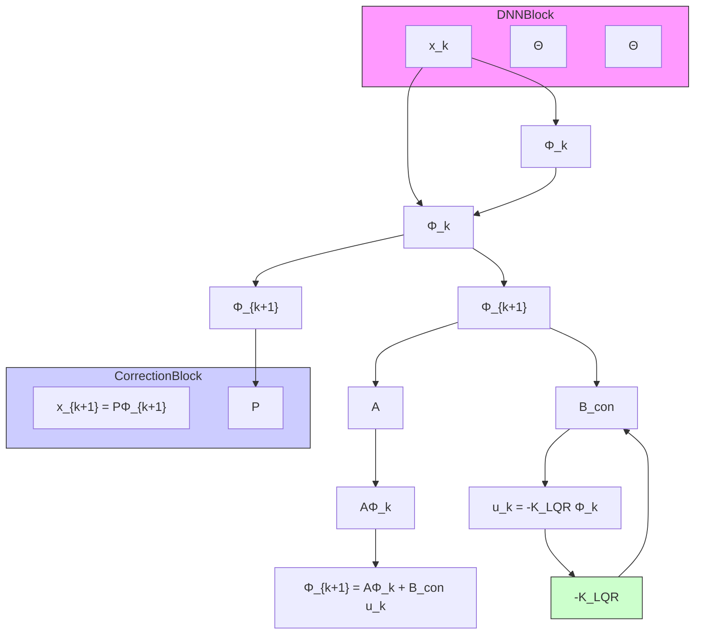

To calculate the approximate Koopman operator K and the input matrix B, the time history of measurement data for M steps is arranged into snapshot matrices. The first matrix, X, is the state history from time $k = 1 \mathrm { ~ t o ~ } k = M - 1$ , whilst the second matrix, $X ^ { \prime }$ is the same state history, right shifted by one-time step:

$$X = \left[ x _ {1}, x _ {2}, x _ {3}, \dots , x _ {M - 1} \right] \tag {7}$$

flowchart

Fig. 1. Complete schematic of dynamic propagation of the states, including the control input. Note that a decoder is not needed.

$$X ^ {\prime} = \left[ x _ {2}, x _ {3}, x _ {4}, \dots , x _ {M} \right] \tag {8}$$

Mapping the measured states with observable functions leads to

$$\boldsymbol {\Phi} (X) = \left[ \boldsymbol {\Phi} (x _ {1}), \boldsymbol {\Phi} (x _ {2}), \dots , \boldsymbol {\Phi} (x _ {M - 1}) \right] \tag {9}\Phi (X ^ {\prime}) = \left[ \Phi (x _ {2}), \Phi (x _ {3}), \dots , \Phi (x _ {M}) \right] \tag {10}$$

Given the dataset, the matrices K and B can be found using least-sqaures

$$\min \sum \left\| \boldsymbol {\Phi} (x _ {k + 1}) - (\mathbf {K} \boldsymbol {\Phi} (x _ {k}) + \mathbf {B} u _ {k}) \right\| ^ {2}. \tag {11}$$

Applying the snapshot matrices of real data yields

$$
\boldsymbol {\Phi} (\mathbf {X} ^ {\prime}) \approx \mathbf {K} \boldsymbol {\Phi} (\mathbf {X}) + \mathbf {B} \mathbf {U} = \left[ \begin{array}{l l} \mathbf {K} & \mathbf {B} \end{array} \right] \left[ \begin{array}{c} \boldsymbol {\Phi} (\mathbf {X}) \\ \mathbf {U} \end{array} \right]; \tag {12}
$$

therefore,
