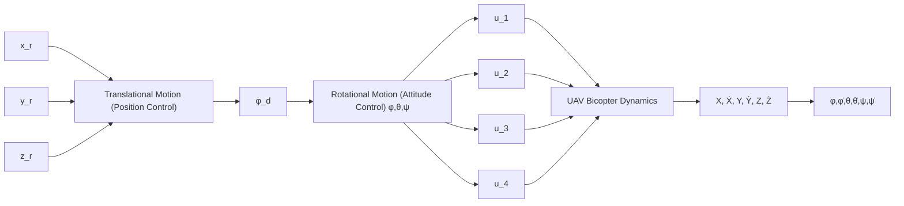

# III. TRAJECTORY TRACKING CONTROL OF BICOPTER USING LQG

Figure 4 shows the block diagram of the closed-loop control system on the UAV Bicopter, which consists of two loops: 1) the inner loop and 2) the outer loop. These two loops are described as follows:

• Attitude control (inner loop), controlling the orientation attitude of the UAV in the form of rotational movement. As an inner loop in the UAV system, the rotational motion system must have a fast settling time to support the translational motion system as an outer loop.   
• Position control (outer loop), controlling the position of the UAV in the form of translational motion. The problem that arises in this position control is tracking. The translational motion system must be able to follow the given reference signal and overcome the given disturbance.

flowchart

FIGURE 4: Closed loop control system on UAV Bicopter.

Using full state feedback control, we can ensure that all eigenvalues of the closed-loop system lie in the left half of the complex plane. This is accomplished by stabilizing a particular system. Consider a linear dynamic system represented by the form ${ \dot { x } } = A x + B u$ in the state space. By utilizing the full state feedback, which represents a linear combination of the state variables, that is $u = - K x$ in order for the closedloop system, which is given by Eq. (22).

$$\dot {x} = (A - B K) x \tag {22}y = C x$$

One type of full-state feedback optimal control is the linear quadratic regulator (LQR). The optimality criterion for LQR is specified by the cost function in Eq. (24). The cost of each state x and control input u for a system defined in linear state space is represented by matrices Q and R. Calculating the control inputs that will yield the lowest possible value of cost function J is referenced in Eq. (25). The continuous Ricatti equation has a solution of P, as in Eq. (26).
