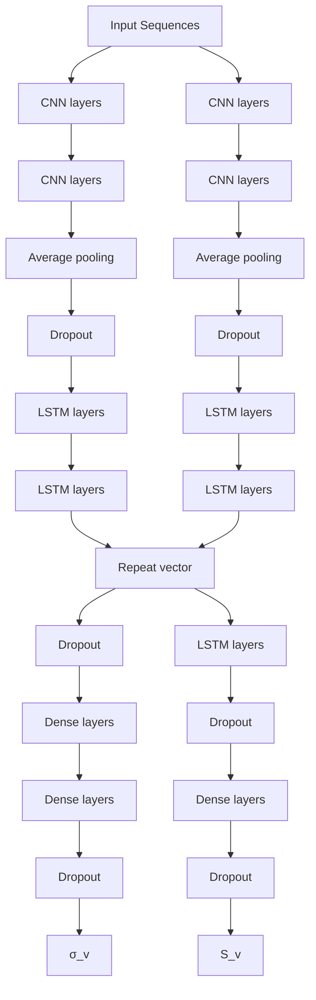

# V. SLIP AND UNDESIRED SKID ESTIMATORS

This paper utilizes the two previously developed deep learning models [6], [8] to estimate the robot’s slipping $( s _ { v } )$ and undesired skidding $( \sigma _ { v } )$ . The structure and details of the recommended models for slip (CNN-LSTM-AE) and undesired skid (CNN-LSTM) estimations are shown in Figure 2 and Table 1. Input sequences for these models are formulated utilizing data derived from the robot's IMU and

flowchart

Figure 2. Left: Undesired skid estimation model (CNN-LSTM). Right: Slip estimation model (CNN-LSTM-AE).

Table 1. The hyperparameters of the undesired skid (CNN-LSTM) and slip (CNN-LSTM-AE) estimation models.

<table><tr><td>Type</td><td>Undesired Skid</td><td>Slip</td></tr><tr><td>Batch size</td><td>128</td><td>64</td></tr><tr><td>Conv1D (F, K, S)</td><td>28, 3, 1</td><td>67, 5, 1</td></tr><tr><td>Conv1D (F, K, S)</td><td>32, 3, 1</td><td>73, 5, 1</td></tr><tr><td>Average Pooling</td><td>1</td><td>1</td></tr><tr><td>Dropout</td><td>0.0</td><td>0.2</td></tr><tr><td>LSTM unit</td><td>42</td><td>44</td></tr><tr><td>LSTM unit</td><td>121</td><td>50</td></tr><tr><td>Dropout</td><td>0.4</td><td>0.4</td></tr><tr><td>Dense unit</td><td>131</td><td>298</td></tr><tr><td>Dense unit</td><td>112</td><td>-</td></tr><tr><td>Dropout</td><td>0.5</td><td>0.0</td></tr><tr><td>Dense unit</td><td>1</td><td>1</td></tr></table>
