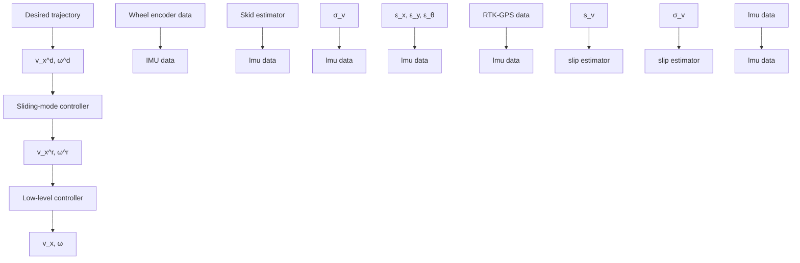

In addition to tracking errors, the distance tracking error (dis) and the root mean square error (RMSE) were considered to compare the SMC and SMC-SS performance as follows:

$$d i s = \sqrt {e _ {x} ^ {2} + e _ {y} ^ {2}} \tag {58}R M S E = \sqrt {\frac {\sum_ {i = 1} ^ {N} e _ {*} ^ {2}}{N}}, \tag {59}$$

where N is the number of samples.

Finally, the non-parametric Friedman aligned ranking (FAR) test was utilized to investigate the statistical significance in the performance of the SMC and SMC-SS controllers to check if the SMC and SMC-SS performed similarly. In the case of having the null hypothesis of the FAR test rejected, the post hoc Finner test was applied to determine if there was a significant difference between the two controllers. For both tests, the significance level of 0.05 was considered [43].

flowchart

Figure 3. The proposed control block-diagram
