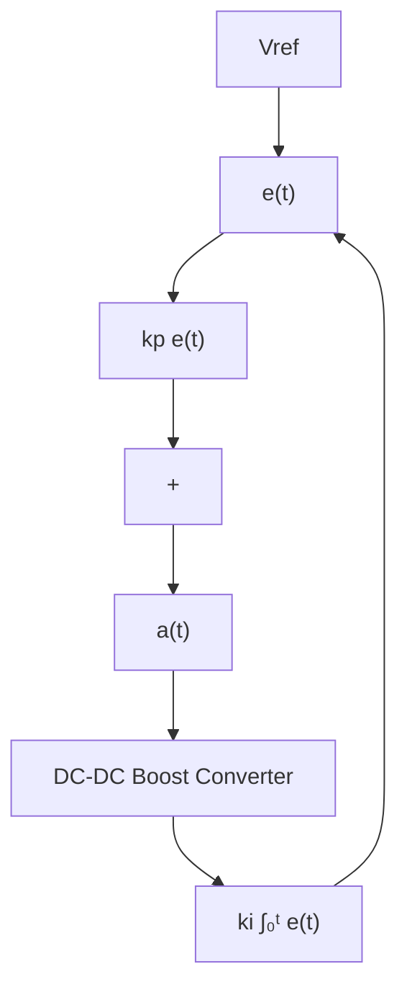

# 5.1.1 PI Control

The PI controller is a feedback control loop that calculates an error signal by measuring the difference between the system’s output and a desired reference value. This algorithm constantly examines the output voltage and modifies the duty cycle of the converter to uphold the desired output voltage level. To put it simply, it closely monitors the output voltage and adjusts it as needed to maintain the correct level. The PI controller utilizes a feedback control loop mechanism to minimize the influence of disturbances in a system, steer the system towards a desired state, and define explicit linkages between system variables. The input of the system is the error at a certain time, $e ( t )$ , which represents the difference between the measured and reference values as shown in Fig. 6. The PI controller produces an output called ‘actuation’, denoted as $a ( t )$ , which determines the action to be implemented for the given plant or system. The actuation, $a ( t )$ , is determined by adding two components: the product of the proportional gain $\left( k _ { p } \right)$ and the magnitude of the error, and the product of the integral gain $( k _ { i } )$ and the integral of the error over time. The function, $a ( t )$ , can be written as Eq. 7,

flowchart

Fig. 6: Boost converter with PI control

$$a (t) = k _ {p} * e (t) + k _ {i} \int_ {0} ^ {t} e (t) d t \tag {7}$$
