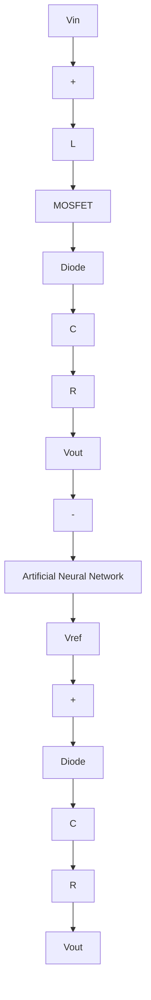

# 5.1.2 ANN Control

A DC-DC boost converter with artificial neural network (ANN) control is a power converter that enhances the voltage of a DC input source by utilizing an advanced control mechanism based on neural network technology. The ANN control mechanism mimics the behavior of a human neural network, enabling the converter to adapt and enhance its performance in real time. The ANN control algorithm continuously checks both the converter’s input, $V _ { i n }$ , and the target output, $V _ { r e f }$ to ensure optimal performance as shown in Fig. 7, altering its control signals accordingly.

A substantial amount of data (100000 data samples) is generated using the MAT-LAB editor during the development of an artificial neural network (ANN) model, generating the dataset. The dataset is made up of data samples with input and output voltages that serve as input features for the ANN model. 80% of the data is used for training, and the remaining 20% is used for testing. Following that, the neural network is built and trained using MATLAB’s graphical user interfaces (GUIs) intended exclusively for neural network (NN) applications. After the dataset has been built within the MATLAB workspace, these GUIs make it easier to create and train the neural network. To improve the performance of the neural network (NN) model, the training parameters were fine-tuned. Table 5 shows the specifications of the NN model. After training, the NN model is exported to the MATLAB workspace and converted into a Simulink block. This Simulink block manages the boost converter’s duty cycle, giving it control over its operation.

flowchart

Fig. 7: Boost converter with ANN control

Table 5: Specifications of neural network.

<table><tr><td>Parameters</td><td>Training Configuration</td></tr><tr><td>Type of Network</td><td>Feed-Forward Backpropagation</td></tr><tr><td>Training Function</td><td>TRAINLM</td></tr><tr><td>Adaption Learning Function</td><td>LEARNGDM</td></tr><tr><td>Objective Function</td><td>MSE</td></tr><tr><td>Number of Layers</td><td>3</td></tr><tr><td>Transfer Function</td><td>TANSIG</td></tr></table>
