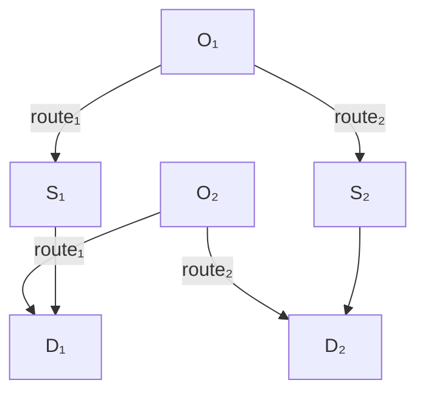

# 1. Introduction

Traffic signal control and vehicle routing are recognized as effective measures to alleviate traffic congestion and enhance traffic efficiency in urban road networks. The signal settings are intrinsically linked to the route decisions made by drivers. This is because the traffic control system is designed to improve network performance, which is accomplished through a comprehensive analysis of the network flow patterns that encompasses drivers' route decisions. Conversely, particular signal controls can have an impact on the cost of different routes, prompting drivers to select particular routes for selfoptimization or to achieve system optimization. The mutually beneficial objectives and interdependence of signal control and vehicle routing make collaborative optimization achievable, resulting in a substantial enhancement in network performance.

Connected and autonomous vehicles possess the capability to establish dependable two-way communications between vehicles and infrastructure, enabling the possibility of achieving a system optimum through synergistic vehicle routing and traffic signal control Li, Mirchandani, and Zhou (2015). Fig.1 illustrates a simplified network and the influence of a collaborative strategy involving signal control and vehicle routing. By rerouting the vehicles of $( O _ { 1 } , D _ { 1 } )$ , the arrival times of conflicting vehicles in $S _ { 1 }$ and $S _ { 2 }$ are staggered, and optimized signal timings of $S _ { 1 }$ and $S _ { 2 }$ enables vehicles to leave the intersection as soon as possible.

Deep reinforcement learning (DRL) demonstrates exceptional potential in managing dynamic and complex environments, optimizing long-term performance, and making real-time decisions. As a result,

DRL has seen increasing applications in the field of intelligent transportation systems, including trafficsignal control, autonomous driving and traffic assignment(F. Yang et al. 2021a).

flowchart

$$
\begin{array}{c} \text {Path} = \{(O _ {1}, S _ {1}, D _ {1}), (O _ {1}, S _ {2}, D _ {1}) \\ , (O _ {2}, S _ {1}, S _ {2}, D _ {2}) \} \end{array}
$$
