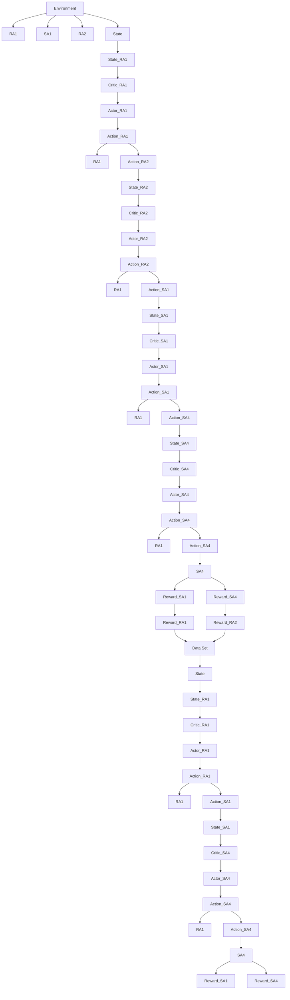

Fig.3 shows the implementation architecture of the joint optimization method based on MAA2C

DRL approach. A decentralized training and execution approach is employed, whereby each agent has its own policy network and value network. This means that each agent to learn its own decision-making policy and value function independently, based on its own observations (referred to as local state) and rewards. As the actions of each agent can impact the next state of the environment, it can subsequently affect the behaviors of other agents within the system. To promote coordination among the agents, shared observations and rewards are utilized, enabling agents to exchange information and synchronize their behaviors. Additional details regarding this approach will be provided in Section 4.1.

flowchart

Figure 3 The implementation architecture of joint control
