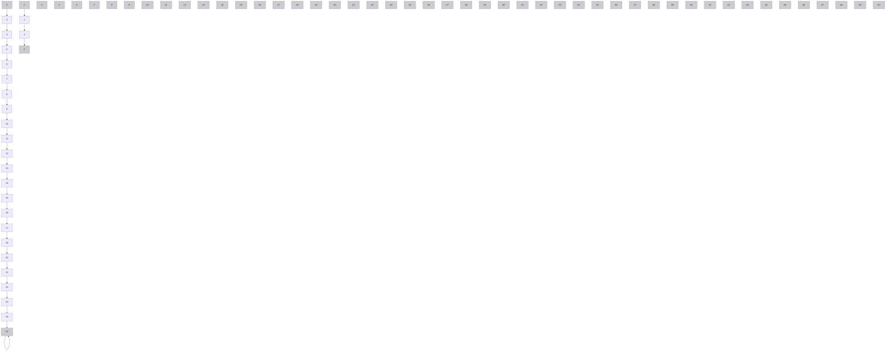

# 5.1.1. Environment settings

SUMO-simulated traffic environment is adopted to evaluate the effectiveness of the proposed method.

We test the proposed joint control method in a modified Sioux Falls network. The simulated traffic environment for each episode lasts 3600 seconds, with the control step length and the duration of the transition phase set to 5 seconds.

Fig. 6 shows the layout of the network, which includes 17 signalized intersections，7 intersections under priority control and 7 external intersections that serve as origin and destination nodes for traffic demand.

flowchart

Figure 6 The modified Sioux Falls network

The edges in the road network are bidirectional with two lanes in each direction. As shown in Fig.6, there are three types of signalized intersections, respectively with three, four, five inbound roads. The layout and potential signal phases of these intersections are presented in Table B.1.

Time-varying traffic flows are applied to train the control policy and improve its efficiency under varying traffic conditions. Four types of flow distribution are designed and presented in Figure B.1. Flow ratio represents the proportion between the current flow and the peak flow. The OD pairs and their potential routes, peak flow and the type of flow fluctuations and corresponding RAs are shown in Table

B.2. In summary, the simulation environment consists of 17 SAs and 12 RAs.
