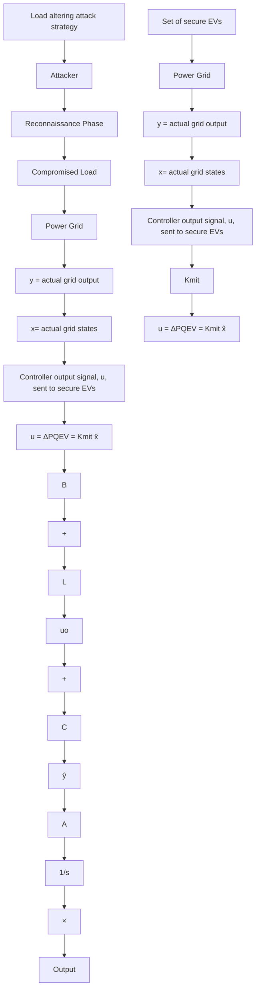

# C. Related Studies

Most grid protection techniques target very specific attack types while disregarding others. The authors of [5], for instance, consider that the current N-1 contingency criterion is enough to mitigate the impact of static attacks but proposed a variation of such attacks able to circumvent it and disregard other attack types. The wide area controller proposed in [15] is designed to mitigate switching attacks below 2 Hz making this scheme less effective against higher frequency attacks as well as dynamic attacks. An optimal output feedback controller was used in [16] against inter-area oscillation caused by an individual event on the grid. This work, however, is not meant to mitigate attacks.

flowchart

Fig. 1. Defender’s state-space model and interaction with the attacked grid

Multiple works have considered supporting grid operation by using EVs. The work in [17] for example discusses EV charging at non-unity power factor to inject/draw reactive power and includes it in the optimization of EV charging scheduling [17]. This strategy was able to reduce the overall cost of integration of EVs into the distribution grid and improve voltage stability [17]. Similarly, in [18] bidirectional EV charging is optimized to perform peak shaving for the grid during peak demand times.
