# E. EV User Impact and Privacy Concerns

This scheme does not require a change in user behavior. The utility will only utilize EVs that are connected to EVCSs at the instance of attack. Furthermore, an 11kW EVCS delivers a charge of 0.9 miles/min. Thus, mitigating an attack lasting a few seconds will have an unnoticeable impact on the EV’s ranges. Such a scheme should only involve EVs whose owners gave consent to participate through a utility-managed incentive program. Hydro-Quebec implements a similar program, the Hilo project [22], which allows them to control home loads to reduce demand during peak times with plans to extend it to EVs.

```mermaid
graph TD
    A["~"] --> B["30"]
    A --> C["25"]
    A --> D["1"]
    A --> E["39"]
    F["~"] --> G["37"]
    F --> H["26"]
    F --> I["27"]
    F --> J["17"]
    F --> K["18"]
    F --> L["16"]
    F --> M["15"]
    N["~"] --> O["28"]
    N --> P["29"]
    N --> Q["38"]
    R["~"] --> S["21"]
    R --> T["36"]
    R --> U["23"]
    V["~"] --> W["24"]
    V --> X["19"]
    V --> Y["34"]
    V --> Z["33"]
    AA["~"] --> AB["22"]
    AA --> AC["35"]
    AD["~"] --> AE["31"]
    AD --> AF["32"]
    AG["~"] --> AH["11"]
    AG --> AI["10"]
    AJ["~"] --> AK["7"]
    AJ --> AL["6"]
    AM["~"] --> AN["5"]
    AM --> AO["4"]
    AP["~"] --> AQ["3"]
    AP --> AR["2"]
```

flowchart

Figure 4. New England 39-bus grid
