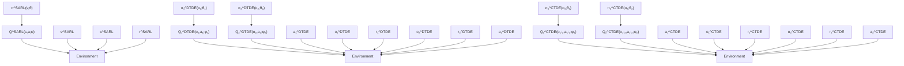

# D. Decoupled Yaw Control System

In (7) and (8), the translational dynamics are coupled with the attitude dynamics only through $R e _ { 3 } = b _ { 3 }$ . In other words, the direction of $b _ { 1 }$ and $b _ { 2 }$ does not affect the translational dynamics. This is because the direction of thrust is fixed to $b _ { 3 }$ always, and any rotation about $b _ { 3 }$ does not affect the resultant thrust. In fact, the dynamics of $b _ { 3 }$ can be separated from the full attitude dynamics (9) and (10), by assuming that the quadrotor is inertially symmetric about its third body-fixed axis, i.e., $J _ { 1 } = J _ { 2 }$ . This yields the following translational dynamics decoupled from the yaw,

$$\dot {x} = v, \tag {12}m \dot {v} = m g e _ {3} - f b _ {3}, \tag {13}\dot {b} _ {3} = \omega_ {1 2} \times b _ {3}, \tag {14}J _ {1} \dot {\omega} _ {1 2} = \tau , \tag {15}$$

See [4], [16] for details. Here, $\omega _ { 1 2 } ~ \in ~ \mathbb { R } ^ { 3 }$ is the angular velocity of $b _ { 3 }$ resolved in the inertial frame, i.e., ω12 = $\Omega _ { 1 } b _ { 1 } + \Omega _ { 2 } b _ { 2 }$ , satisfying $\omega _ { 1 2 } \cdot b _ { 3 } = \dot { \omega } _ { 1 2 } \cdot b _ { 3 } = 0 .$ . In (15), the fictitious control moment is defined by $\tau = \tau _ { 1 } b _ { 1 } + \tau _ { 2 } b _ { 2 } \in \mathbb { R } ^ { 3 }$ where $\tau _ { 1 } = M _ { 1 } - J _ { 3 } \Omega _ { 2 } \Omega _ { 3 } \in \mathbb { R }$ and $\tau _ { 2 } = M _ { 2 } + J _ { 3 } \Omega _ { 3 } \Omega _ { 1 } \in \mathbb { R }$ , which are related to the first two components of the actual moment $( M _ { 1 } , M _ { 2 } )$ . While there are three elements in τ , it has two degrees of freedom, as $\tau \cdot b _ { 3 } = 0$ always.

flowchart

