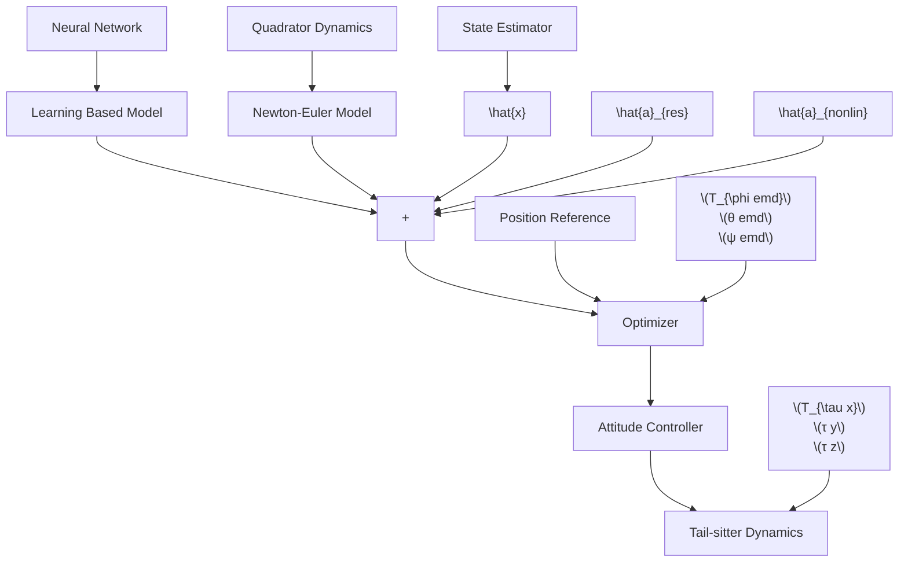

# C. HMPC Implementation

The trained FFNN mentioned in previous section is integrated into a hybrid model that combines the nonlinear and neural network models, which serves as prediction model for the HMPC. The proposed HMPC is implemented in cascaded loops, with the outer loop designed for positional control and the inner loop designed for attitudinal control. In position tracking tasks, the future reference trajectory is usually available several seconds in advance, whereas the reference attitude is calculated in real-time. This indicates that the preview feature is only applicable to outer-loop positional control. To fully exploit the preview feature of MPC, we focused on positional control of the quadrotor tail-sitter UAV. The architecture of the hybrid aerodynamic model and cascaded control loop is shown in Fig. 3, where xˆ denotes the estimated UAV states. There are two components in the HMPC model: a nonlinear quadrotor dynamics model based on a Newton–Euler formalism and a learning-based model describing residual dynamics. The predicted result is the sum of outputs from these two models. The optimizer calculates the attitude and collective thrust commands that minimize the difference between the predicted and reference position, which are then sent to the inner loop for attitude tracking.

flowchart

Fig. 3. Diagram of the cascaded control architecture, where the green blocks indicate the Newton–Euler and learning based models and blue block indicates the proposed HMPC architecture.
