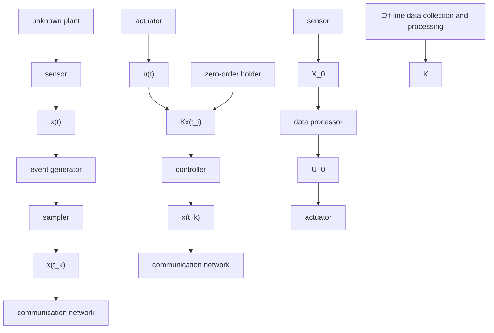

Before presenting the main theorem, a definition relevant to system stability is introduced in the following:

Definition 1: Suppose that there exist constants $c _ { 1 } \geq 1$ , $c _ { 2 } , c _ { 3 } > 0$ , and $c _ { 4 } \geq 0$ , such that any solution x(t) to (1) with input disturbance d(t) in closed-loop with (8) satisfies

$$\| x (t) \| \leq c _ {1} e ^ {- c _ {2} t} \| x (0) \| + c _ {3} \| d (t) \| _ {[ 0, t ]} + c _ {4}, \forall t \geq 0. \tag {13}$$

Then, the system (1) is with exponential ISS property with respect to disturbance if $c _ { 4 } = 0$ , and the system (1) is with practical exponential ISS property if $c _ { 4 } > 0 .$ .

Now, we are ready to present the main results of this section.

Theorem 1: Suppose that Assumptions 1– 4 hold, and there exist proper positive constants $\alpha , \beta , \delta ,$ , such that the following data-driven LMI holds

$$
\left[ \begin{array}{c c c} - \frac {\delta}{8} \mathcal {P} \Omega \mathcal {P} + \alpha \mathbf {I} & \delta \mathcal {P} \mathcal {X} _ {1} \mathcal {Q} & \delta \mathcal {P} \Delta \\ \star & \gamma \mathcal {Q} ^ {T} \mathcal {Q} - \beta \mathbf {I} & \mathbf {0} \\ \star & \star & - \gamma \mathbf {I} \end{array} \right] \preceq 0. \tag {14}
$$

flowchart

Fig. 1. Implementation process of the proposed data-driven dynamic eventtriggered control scheme, where the devices in the orange blocks are common in traditional control mode, and those in the green blocks are essential in the data-driven event-triggered control framework.

Using the dynamic ETM (4)–(7), the event-based controller (8), and the data-driven feedback gain matrix (9), then,

(i) the system (1) features the exponential ISS property with respect to disturbance;   
(ii) the inter-event intervals are lower bounded by a strictly positive constant.

The proof of Theorem 1 is presented in Appendix A.
