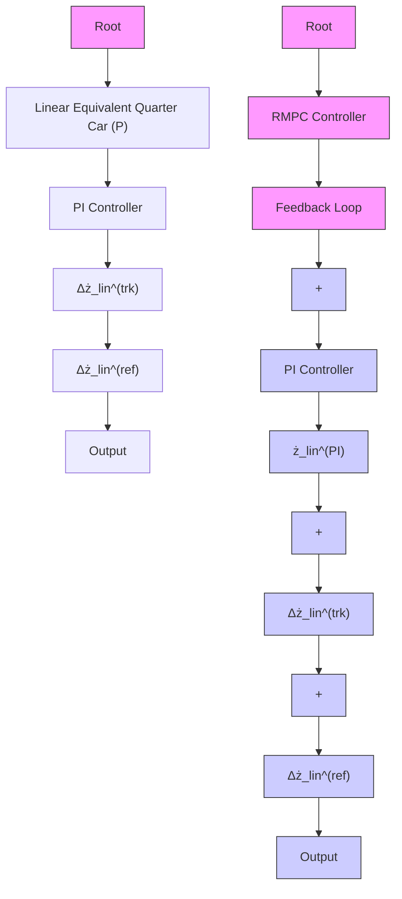

Fig. 3. RMPC scheme with PI incorporated plant model of linear equivalent quarter car SAVGS, where d¯ corresponds to the stacked vector for disturbance bound, $P ^ { \prime }$ to the new uncertain system with parallel PI incorporated, and $\Delta z _ { l i n } ^ { ( r e f ) }$ ∆z(relin to the exogenous reference signal of linear actuator displacement.

line

| Δθ_SL (deg) | α = ż_in / ω_SL (m/rad) | β = Δz_in (m) |
| --- | --- | --- |
| 0 | 0.0000 | -0.0200 |
| 45 | 0.0125 | -0.0125 |
| 90 | 0.0175 | -0.0050 |
| 135 | 0.0125 | 0.0125 |
| 180 | 0.0000 | 0.0200 |

Fig. 4. Plots of functions α (top) and β (bottom) for conversion between the multibody and linear equivalent models.

The single link torque $T _ { S L }$ in the nonlinear model is constrained between T (miSL $T _ { S L } ^ { ( m i n ) }$ and $T _ { S L } ^ { ( m a x ) }$ , to avoid gearbox backlash effects and to respect the motor continuous torque limit, respectively. Function α is employed again to convert the nonlinear variable $T _ { S L }$ to its linear equivalent actuator force $F _ { l i n } \ { \left( \alpha = T _ { S L } / F _ { l i n } \right. }$ also) [5], where $F _ { l i n }$ can be calculated by adding the equilibrium (the sprung mass weight) and increment (shown on the right hand side of the first equation in (1)) values of the equivalent passive spring force, with the equivalent damper force neglected due to its much smaller magnitude than the equivalent spring force (as verified by simulations). Thus, $F _ { l i n }$ can be expressed in terms of the states $\Delta l _ { s }$ and $\Delta z _ { l i n } .$ , as follows:
