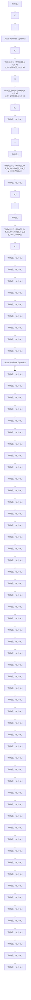

```mermaid
graph TD
    A["\hat{x}_t"] --> B["K"]
    B --> C["+"]
    C --> D["Actual Nonlinear Dynamics"]
    D --> E["y_t"]
    E --> F["\hat{x}_{t+1} = f(\tilde{x}_t, u_t, w)\ny_t = g(\tilde{x}_t, u_t, w)"]
    F --> G["w"]
    G --> H["\tilde{x}_{t+1} = f(\tilde{x}_t, u_t, w)\ny_t = g(\tilde{x}_t, u_t, w)"]
    H --> I["y_t"]
    I --> J["\hat{x}_t + y_t - y_t"]
    J --> K["-"]
    K --> L["+"]
    L --> M["\hat{y}_t"]
    M --> N["\hat{x}_{t+1} = A\hat{x}_t + B_2u_t + L(\hat{y}_t - y_t)\ny_t = C_2\hat{x}_t"]
    N --> O["\hat{x}_t + y_t - y_t"]
    O --> P["u_f"]
    P --> Q["+"]
    Q --> R["\hat{y}_t"]
    R --> S["\hat{x}_{t+1} = A\hat{x}_t + B_2u_t + L(\hat{y}_t - y_t)\ny_t = C_2\hat{x}_t"]
    S --> T["y_t"]
    T --> U["\hat{y}_t + y_t - y_t"]
    U --> V["\hat{y}_t + y_t - y_t"]
    V --> W["\hat{y}_t + y_t - y_t"]
    W --> X["\hat{y}_t + y_t - y_t"]
    X --> Y["\hat{y}_t + y_t - y_t"]
    Y --> Z["\hat{y}_t + y_t - y_t"]
    Z --> AA["\hat{y}_t + y_t - y_t"]
    AA --> AB["\hat{y}_t + y_t - y_t"]
    AB --> AC["\hat{y}_t + y_t - y_t"]
    AC --> AD["\hat{y}_t + y_t - y_t"]
    AD --> AE["\hat{y}_t + y_t - y_t"]
    AE --> AF["\hat{y}_t + y_t - y_t"]
    AF --> AG["\hat{y}_t + y_t - y_t"]
    AG --> AH["\hat{y}_t + y_t - y_t"]
    AH --> AI["\hat{y}_t + y_t - y_t"]
    AI --> AJ["\hat{y}_t + y_t - y_t"]
    AJ --> AK["\hat{y}_t + y_t - y_t"]
    AK --> AL["\hat{y}_t + y_t - y_t"]
    AL --> AM["\hat{y}_t + y_t - y_t"]
    AM --> AN["\hat{y}_t + y_t - y_t"]
    AN --> AO["\hat{y}_t + y_t - y_t"]
    AO --> AP["\hat{y}_t + y_t - y_t"]
    AP --> AQ["\hat{y}_t + y_t - y_t"]
    AQ --> AR["\hat{y}_t + y_t - y_t"]
    AR --> AS["\hat{y}_t + y_t - y_t"]
    AS --> AT["\hat{y}_t + y_t - y_t"]
    AT --> AU["\hat{y}_t + y_t - y_t"]
    AU --> AV["\hat{y}_t + y_t - y_t"]
    AV --> AW["\hat{y}_t + y_t - y_t"]
    AW --> AX["\hat{y}_t + y_t - y_t"]
    AX --> AY["\hat{y}_t + y_t - y_t"]
    AY --> AZ["\hat{y}_t + y_t - y_t"]
    AZ --> BA["\hat{y}_t + y_t - y_t"]
    BA --> BB["\hat{y}_t + y_t - y_t"]
    BB --> BC["\hat{y}_t + y_t - y_t"]
    BC --> BD["\hat{y}_t + y_t - y_t"]
    BD --> BE["\hat{y}_t + y_t - y_t"]
    BE --> BF["\hat{y}_t + y_t - y_t"]
    BF --> BG["\hat{y}_t + y_t - y_t"]
    BG --> BH["\hat{y}_t + y_t - y_t"]
    BH --> BI["\hat{y}_t + y_t - y_t"]
    BI --> BJ["\hat{y}_t + y_t - y_t"]
    BJ --> BK["\hat{y}_t + y_t - y_t"]
    BK --> BL["\hat{y}_t + y_t - y_t"]
    BL --> BM["\hat{y}_t + y_t - y_t"]
    BM --> BN["\hat{y}_t + y_t - y_t"]
    BN --> BO["\hat{y}_t + y_t - y_t"]
    BO --> BP["\hat{y}_t + y_t - y_t"]
    BP --> BQ["\hat{y}_t + y_t - y_t"]
    BQ --> BR["\hat{y}_t + y_t - y_t"]
    BR --> BS["\hat{y}_t + y_t - y_t"]
    BS --> BT["\hat{y}_t + y_t - y_t"]
    BT --> BU["\hat{y}_t + y_t - y_t"]
    BU --> BV["\hat{y}_t + y_t - y_t"]
    BV --> BW["\hat{y}_t + y_t - y_t"]
    BW --> BX["\hat{y}_t + y_t - y_t"]
    BX --> BY["\hat{y}_t + y_t - y_t"]
    BY --> BZ["\hat{y}_t + y_t - y_t"]
    BZ --> CA["\hat{y}_t + y_t - y_t"]
    CA --> CB["\hat{y}_t + y_t - y_t"]
    CB --> CC["\hat{y}_t + y_t - y_t"]
    CC --> CD["\hat{y}_t + y_t - y_t"]
    AD["Actual Nonlinear Dynamics"] --> AE
```

