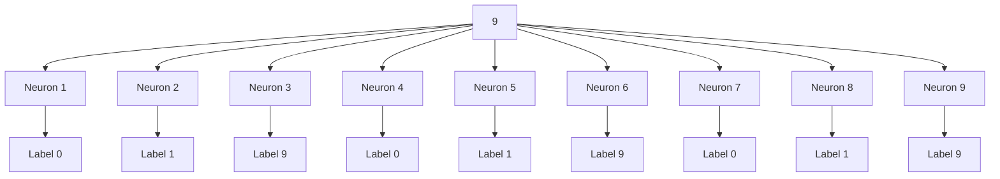

# 1. Array of blue light lasers

A cross section of lasers with each

pinpointed at one neuron. Strength:

1mW/mm2

Time: 5ms pulse

Type: Blue light laser 473 nm

flowchart

Fig 2.3. Proposed architecture for the training of the neural network. A three-layer neural network, with pixel intensities converted to spike trains for input. The indirect training and readout is done by an array of LEDs and various recording hardware.

Hardware developed by groups like [22][24] have been shown to stimulate with single neuron precision, which is a requirement for the algorithm proposed.
