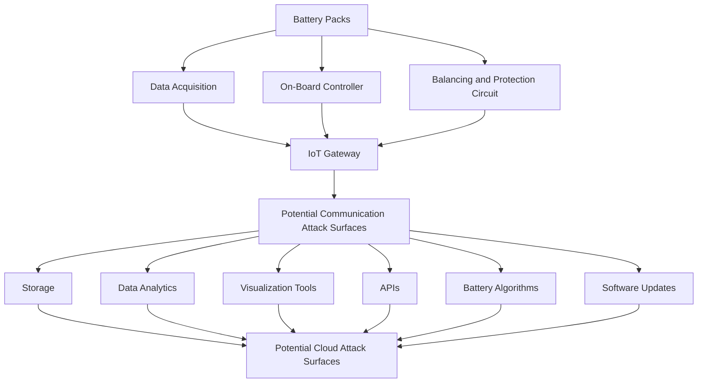

Fig. 1. A simplified schematic of cyber physical BESS, adopted and modified from [20].

Due to the presence of WiFi or Bluetooth connectivity, the adversary can eavesdrop into this network from a short distance. The common entry points, devices through which an attacker remotely connect with the system, are service equipment, public-facing infrastructure, vendor cloud service or server, Local Area Network (LAN), WiFi or bluetooth connected devices, meter, software and firmware upgrades, Virtual Private Network (VPN), Virtual Network Computing, etc. [21]. Given the large amounts of security risks faced by CPBS, it is essential to understand the adversarial nature of attackers and hence we focus on the cyber attack perspective. Particularly, we formulate our problem from the point of view of adversaries creating stealthy cyber attacks. This will help us in designing defense strategies against cyber attacks using the knowledge of adversaries obtained by generating stealthy attack policies. The integration of IoT into CPBS introduces various potential attack vectors as this integration adds network connectivity and remote access to physical systems, thereby making them vulnerable to cyber-attacks [22]. These IoT devices in CPBS often collect real-time data allowing automation or remote control of battery operations, which increases the system’s attack surface. As mentioned above, there are various types of attacks that can occur – remote access exploit, data manipulation, denial of service attack, etc. And all these attacks at the end lead to manipulation of the system at sensors and actuators level. Sensors like voltage, current, temperature sensors are the primary sensors that are most susceptible to manipulation as these are the sensors that rely on direct physical measurements and can be spoofed or altered through attacks. This is the main working principle of one of the FDIA attacks – man-in-middle attack.
