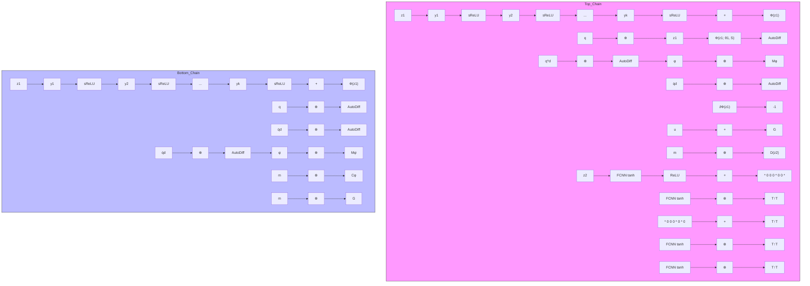

Fig. 1. The structure for proposed NBS controller.

Since $\Phi ( z _ { 1 } )$ is strongly convex in ${ z } _ { 1 }$ and has only one minimum at $z _ { 1 } = 0$ with $\begin{array} { r } { \Phi ( 0 ) = \mathbf { 0 } , } \end{array}$ , in view of Property 1, we have $V ( 0 , 0 ) = 0 , V ( z _ { 1 } , z _ { 2 } ) > 0 , \forall z _ { 1 } \neq 0 , z _ { 2 } \neq 0$ , and $\| z _ { 1 } \| , \| z _ { 2 } \| \to \infty \Rightarrow V ( z _ { 1 } , z _ { 2 } ) \to \infty$ . The time derivative of V is
