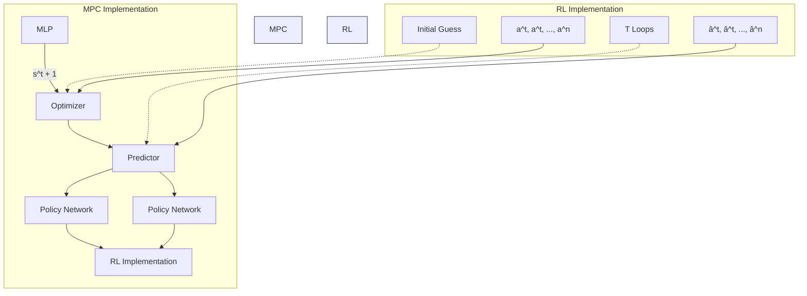

# A. Multi-Agent Proximal Policy Optimization

We now leverage MAPPO algorithm [17] to maximize the return in (3). MAPPO extends the Proximal Policy Optimization (PPO) algorithm [26] to cooperative multi-agent settings, demonstrating remarkable efficiency and effectiveness in a variety of test environments. It adapts PPO’s on-policy reinforcement learning approach, leveraging centralized training with decentralized execution to accommodate the complexities of multi-agent interactions.

flowchart

Fig. 1. Implementation of DeepSafeMPC. This framework can be divided into RL and MPC parts. Within the RL domain, Policy Networks produce initial action vectors $\{ \hat { a } _ { 1 } ^ { t } , \hat { a } _ { 2 } ^ { t } , \dots , \hat { a } _ { n } ^ { t } \}$ . These vectors serve as preliminary inputs to the MPC’s Predictor component and the initial guess for MPC optimizer. The Predictor, utilizing a Multi-Layer Perceptron (MLP), forecasts the forthcoming state $\hat { s } ^ { t + 1 }$ based on the current state st and action at . Subsequently, the Optimizer refines these actions into an optimized sequence $\mathbf { a } ^ { t } = \{ \bar { a } _ { 1 } ^ { t } , a _ { 2 } ^ { t } , \ldots , a _ { n } ^ { t } \}$ over the decision horizon T .

MAPPO trains two separate neural networks: a decentralized actor network with parameters θ , and a centralized critic function network with parameters $\phi .$ This design is import for enabling the different patterns of training and execution to benefit from the respective advantages of centralized training and decentralized execution.
